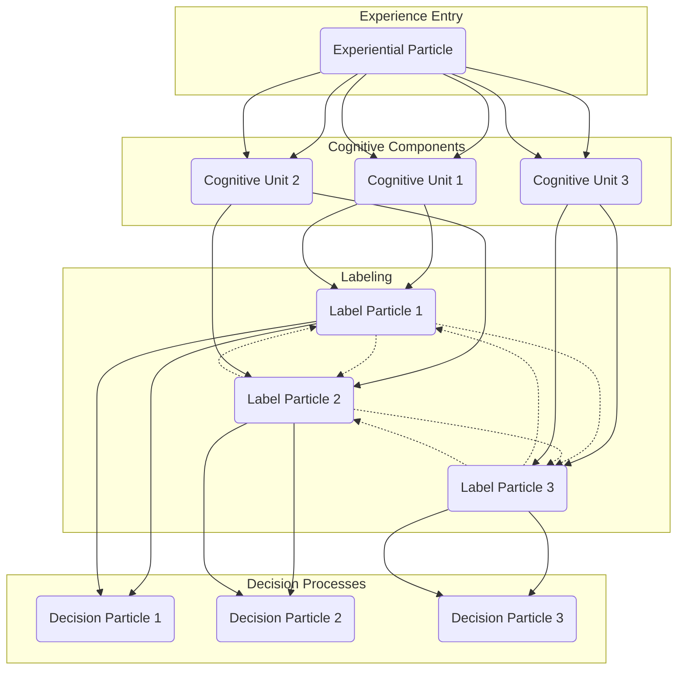

**USER**

maybe we can model some component of this similar to an immune response. Let's say some experiential data enters the system and is integrated into some cognitive unit such that the experience is represented as a particle. cognitive components will be attracted to this particle based on some sort of relevance or salience with respect to that component and its current state. maybe we could have "labeling" particles that represent different kinds of judgements we might make about the experience, so judgements will be attracted more or less to certain experiences based on some function of state like causal orientation or drive satisfaction. the "labeling component" particles of various kinds might compete to dominate the representation, (with this competition of this kind equating to cognitive load and internal tension). the labels that are attracted to the experience will then in turn recruit particles involved in decision processes to elicit a response conditioned on the dominating labels

**ASSISTANT**

### Cognitive Immune Response Model

To model the cognitive response to experiential data in a manner analogous to an immune response, we can represent experiences as particles that attract various cognitive components based on relevance, salience, and current state. This model will incorporate labeling particles representing judgments, which compete to dominate the representation of the experience, leading to decision processes and eliciting responses. Below is the detailed structure and mermaid diagram of this hierarchical model.

#### Model Components

1. **Experiential Particle (E_x)**: Represents an incoming experience or data.
2. **Cognitive Unit (C_x)**: Represents cognitive components that interact with the experience based on relevance and salience.
3. **Labeling Particles (L_i)**: Represent different kinds of judgments or labels that are attracted to the experience. Examples include causal orientation, drive satisfaction, etc.
4. **Decision Particles (D_j)**: Represent particles involved in decision processes that are recruited based on the dominating labels.

### Cognitive Immune Response Process

1. **Experience Entry**: An experience enters the system and is represented as an experiential particle (E_x).
2. **Attraction of Cognitive Components**: Cognitive units (C_x) are attracted to the experiential particle based on relevance and salience.
3. **Labeling**: Labeling particles (L_i) are attracted to the experience, with their attraction influenced by factors like causal orientation or drive satisfaction.
4. **Competition**: Labeling particles compete to dominate the representation of the experience, equating to cognitive load and internal tension.
5. **Decision Recruitment**: The dominant labels recruit decision particles (D_j) to elicit a response conditioned on the labels.

### Mermaid Diagram

Here is the mermaid diagram representing the hierarchical model:

### Explanation

- **Experiential Particle (E_x)**: The experience enters the system and attracts cognitive units.
- **Cognitive Units (C_x)**: These units are drawn to the experiential particle based on relevance and salience, processing the experience.
- **Labeling Particles (L_i)**: Various labels or judgments attach to the experience, influenced by cognitive components. The dashed lines between labels represent competition among them.
- **Decision Particles (D_j)**: The dominant labels recruit decision particles, which determine the response based on the processed experience and attached judgments.

### Mathematical Formalization

To formalize this model mathematically:

1. **Attraction to Experience**:
   $$
   A_{C_i, E_x} = f(R_i, S_i)
   $$
   where \( A_{C_i, E_x} \) is the attraction of cognitive unit \( C_i \) to experiential particle \( E_x \), \( R_i \) represents relevance, and \( S_i \) represents salience.

2. **Labeling Competition**:
   $$
   C_{L_i, E_x} = g(O_i, D_i)
   $$
   where \( C_{L_i, E_x} \) is the competition factor of label \( L_i \) for \( E_x \), \( O_i \) represents causal orientation, and \( D_i \) represents drive satisfaction.

3. **Decision Recruitment**:
   $$
   R_{D_j, L_i} = h(L_i)
   $$
   where \( R_{D_j, L_i} \) is the recruitment of decision particle \( D_j \) by label \( L_i \).

### Conclusion

This cognitive immune response model provides a dynamic and interactive framework to understand how experiences are processed, judged, and acted upon. The competition among labeling particles to dominate the experiential representation reflects cognitive load and internal tension, while the recruited decision particles lead to specific behavioral responses. This model can be further explored in related topics such as [[Cognitive Load Theory]], [[Decision-Making Models]], and [[Judgment and Decision-Making|Judgment Theory]] within this vault.

---

preceding: [[mermaid diagram of the hierarchical model]]  

following: [[empirically grounded cognitive immune response model]]

See also: [[cognitive load]]

See also: [[enhanced cognitive immune response model with particle interactions and bayesian updates]]

See also: [[integration of psychological and social drives in the cognitive immune response model]]

See also: [[empirically grounded cognitive immune response model]]

See also: [[critique and alignment of the cognitive immune response model with modern cognitive science]]