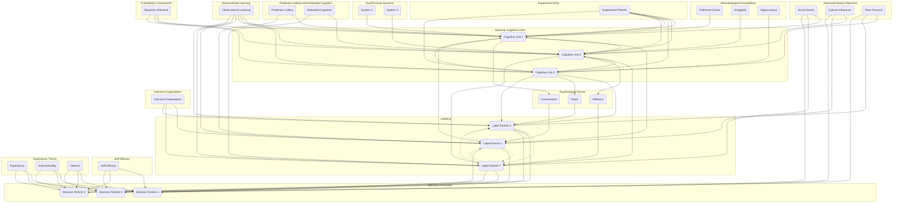

**USER**

adopt the perspective of a cognitive sicentist, critique this model, and propose changes to align the model with modern theory

**ASSISTANT**

### Critique and Alignment of the Cognitive Immune Response Model with Modern Cognitive Science

#### Critique of the Current Model

1. **Over-Simplification of Cognitive Processes**:
   - The model uses particles to represent complex cognitive and emotional processes. While this abstraction can simplify visualization, it might oversimplify how these processes interact in reality.

2. **Static Interactions**:
   - The interactions between components are represented as static connections. Modern cognitive science emphasizes the dynamic nature of cognitive processes, where feedback loops and changes over time are crucial.

3. **Lack of Neurobiological Considerations**:
   - The model does not account for the underlying neurobiological mechanisms that drive cognitive processes, such as neural plasticity and the role of different brain regions.

4. **Simplified Representation of Social Influences**:
   - Social drives are depicted in a way that might not fully capture the complexities of social interactions and cultural influences.

5. **Limited Integration of Modern Cognitive Theories**:
   - The model partially integrates some modern theories but lacks a comprehensive incorporation of theories such as the Dual-Process Theory, predictive coding, and embodied cognition.

### Proposed Changes

To align the model with modern cognitive science, the following changes are proposed:

1. **Dynamic and Feedback-Driven Interactions**:
   - Introduce dynamic interactions and feedback loops to capture the continuous and reciprocal nature of cognitive processes.
   - Implement temporal dynamics to represent how cognitive processes evolve over time.

2. **Incorporation of Neurobiological Foundations**:
   - Integrate neurobiological principles to explain how cognitive and emotional processes are supported by brain structures and neural networks.
   - Use insights from neuroscience to refine the representation of cognitive units and their interactions.

3. **Enhanced Representation of Social and Cultural Influences**:
   - Use a more nuanced approach to represent social and cultural influences, incorporating factors like social identity, group dynamics, and cultural context.

4. **Integration of Modern Cognitive Theories**:
   - Include elements from Dual-Process Theory, predictive coding, and embodied cognition to provide a more comprehensive and realistic framework.

5. **Probabilistic and Bayesian Frameworks**:
   - Adopt probabilistic and Bayesian models to represent the uncertainty and variability in cognitive processes.

### Revised Model Components

1. **Dynamic Cognitive Units (DCU)**:
   - Represent cognitive processes as dynamic units that interact over time, influenced by neural activity and plasticity.
   - Incorporate feedback loops to capture the evolving nature of cognition.

2. **Neurobiological Foundations (NB)**:
   - Embed principles of neural mechanisms and brain structures that support cognitive functions.
   - Highlight the role of key brain regions (e.g., prefrontal cortex, amygdala) in cognitive and emotional processes.

3. **Advanced Social Influences (ASI)**:
   - Represent social influences with greater complexity, considering factors like social identity, group dynamics, and cultural context.
   - Model the impact of social interactions on cognitive and emotional processes.

4. **Dual-Process Systems (DPS)**:
   - Integrate fast, automatic (System 1) and slow, deliberate (System 2) processes.
   - Model the interplay between these systems in decision-making and behavior.

5. **Predictive Coding and Embodied Cognition (PCEC)**:
   - Implement predictive coding to model how the brain anticipates and interprets sensory input.
   - Incorporate embodied cognition to account for the role of the body in shaping cognitive processes.

6. **Probabilistic Frameworks (PF)**:
   - Use probabilistic and Bayesian models to represent uncertainty and variability in cognitive processes.
   - Model belief updating and decision-making as probabilistic inferences.

### Enhanced Graphical Model

Here is an updated mermaid diagram representing the revised model:

### Explanation and Empirical Alignment

- **Dynamic Cognitive Units (DCU)**: Represent cognitive processes with dynamic interactions and feedback loops, reflecting continuous changes in cognition.
- **Neurobiological Foundations (NB)**: Incorporate key brain regions supporting cognitive functions, providing a neurobiological basis for the model.
- **Advanced Social Influences (ASI)**: Represent complex social dynamics and cultural contexts influencing cognition and behavior.
- **Dual-Process Systems (DPS)**: Integrate fast, intuitive processes (System 1) and slow, deliberate processes (System 2), aligning with modern theories of decision-making.
- **Predictive Coding and Embodied Cognition (PCEC)**: Include predictive coding to model anticipatory processes and embodied cognition to reflect the influence of bodily states on cognition.
- **Probabilistic Frameworks (PF)**: Use Bayesian inference to represent the probabilistic nature of cognitive processes and decision-making.

### Conclusion

By incorporating these changes, the revised [[cognitive immune response model]] aligns more closely with modern cognitive science. It captures the dynamic, neurobiological, and social complexities of cognition and behavior, providing a more comprehensive and empirically grounded framework. For further exploration, consider reviewing related topics such as [[Predictive Coding]], [[Embodied Cognition]], and [[Bayesian Inference]] within this vault.

---

preceding: [[expectancy theory]]  

following: [[enhanced [[cognitive immune response model]] with particle interactions and bayesian updates]]

See also: [[embodied cognition]]

See also: [[social influence]]

See also: [[cognitive immune response model]]

See also: [[feedback loops]]