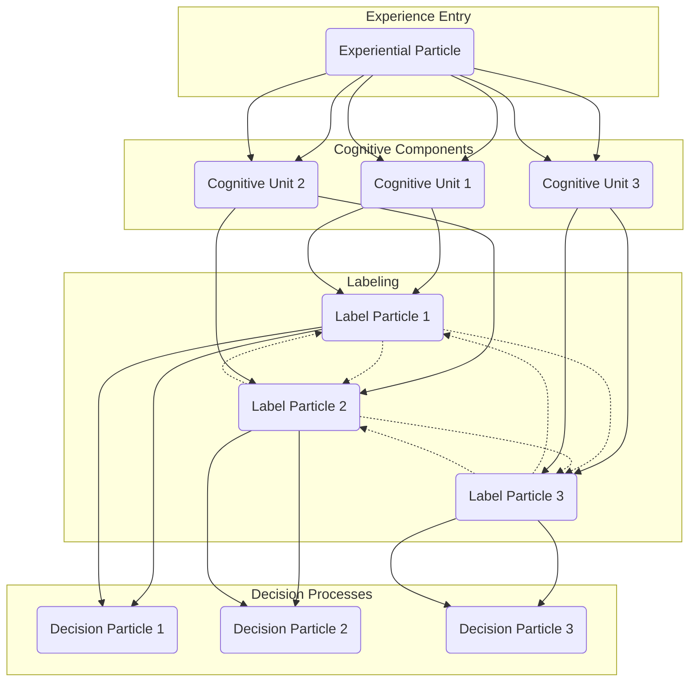

**USER**

this is a rough draft of what I'm going for. I'd like to synthesize and align this with modern models of cognition and behavior for scientific feasibility. The "particles" and their environment can be treated as an abstract representation of emergent properties of a complex system. i want our understanding of what the different parts of the system should be and how they interact to be empirically grounded.

**ASSISTANT**

### Empirically Grounded Cognitive Immune Response Model

To synthesize and align the cognitive immune response model with modern models of cognition and behavior, we need to ensure that the abstract representation of particles and their interactions are based on empirically grounded principles from cognitive science, psychology, and systems theory. Below, we integrate insights from modern theories to provide a scientifically feasible framework.

#### Key Concepts and Theories

1. **Dual-Process Theory**:
   - **System 1**: Fast, automatic, and intuitive processes.
   - **System 2**: Slow, deliberate, and analytical processes.

2. **Connectionist Models**:
   - **Neural Networks**: Represent cognitive processes as interconnected nodes.
   - **Activation Spreading**: Cognitive units activate related units based on learned associations.

3. **Affective-Cognitive Models**:
   - **Appraisal Theory**: Emotions arise from evaluations (appraisals) of events.
   - **Motivational States**: Drives and needs influence cognitive and emotional responses.

4. **Complex Systems Theory**:
   - **Emergence**: Complex behaviors arise from interactions among simpler components.
   - **Dynamic Interactions**: Continuous feedback loops between components.

### Empirical Grounding of Model Components

1. **Experiential Particle (E_x)**:
   - **Definition**: An experience or piece of data entering the cognitive system.
   - **Basis**: Aligns with the concept of sensory input or an external stimulus in cognitive science.

2. **Cognitive Unit (C_x)**:
   - **Definition**: Cognitive components processing the experience based on relevance and salience.
   - **Basis**: Corresponds to neural nodes or modules in connectionist models, with activation influenced by relevance (importance of the stimulus) and salience (prominence).

3. **Labeling Particles (L_i)**:
   - **Definition**: Judgments or labels assigned to experiences, such as causal orientation or drive satisfaction.
   - **Basis**: Reflects appraisal processes in affective-cognitive models, where evaluations of the experience generate specific labels.

4. **Decision Particles (D_j)**:
   - **Definition**: Components involved in decision-making processes, recruited based on dominant labels.
   - **Basis**: Represents decision nodes or processes influenced by the dominant cognitive and emotional evaluations.

### Interactions and Processes

1. **Attraction to Experience**:
   - **Formalization**: Cognitive units are attracted to experiential particles based on relevance and salience.
   - **Equation**:
     $$
     A_{C_i, E_x} = f(R_i, S_i)
     $$
     where \( A_{C_i, E_x} \) is the attraction, \( R_i \) is relevance, and \( S_i \) is salience.

2. **Labeling Competition**:
   - **Formalization**: Labeling particles compete based on cognitive state and drive satisfaction.
   - **Equation**:
     $$
     C_{L_i, E_x} = g(O_i, D_i)
     $$
     where \( C_{L_i, E_x} \) is the competition factor, \( O_i \) is causal orientation, and \( D_i \) is drive satisfaction.

3. **Decision Recruitment**:
   - **Formalization**: Dominant labels recruit decision particles to determine the response.
   - **Equation**:
     $$
     R_{D_j, L_i} = h(L_i)
     $$
     where \( R_{D_j, L_i} \) is the recruitment of decision particle \( D_j \) by label \( L_i \).

### Graphical Model

Here is an updated mermaid diagram incorporating these empirically grounded concepts:

### Explanation and Empirical Alignment

- **Experiential Particle (E_x)**: Represents incoming sensory input or external stimuli.
- **Cognitive Units (C_x)**: Neural or cognitive modules activated by relevance and salience.
- **Labeling Particles (L_i)**: Judgments formed through cognitive appraisal processes, with competition reflecting cognitive load.
- **Decision Particles (D_j)**: Decision-making nodes influenced by the dominant labels, leading to specific responses.

### Empirical Foundations and Applications

1. **Relevance and Salience**: Research shows that attention and cognitive resources are directed towards stimuli that are relevant and salient (e.g., [[Salience Theory]]).

2. **Cognitive and Affective Appraisal**: Studies on appraisal theory demonstrate how individuals evaluate experiences based on their significance and the emotions they evoke (e.g., [[Appraisal Theory]]).

3. **Decision-Making Processes**: Decision-making models highlight the influence of cognitive and emotional factors on choices and actions (e.g., [[Prospect Theory]]).

### Conclusion

This cognitive immune response model, grounded in modern theories of cognition and behavior, provides a comprehensive framework for understanding how experiences are processed, judged, and acted upon. The use of particles and interactions as abstract representations of emergent properties ensures that the model aligns with empirical findings and offers insights into the complex dynamics of cognitive and emotional processes. Further exploration can be done in related topics such as [[Dual-Process Theory]], [[Connectionist Models]], and [[Complex Systems Theory]] within this vault.

---

preceding: [[cognitive immune response model]]  

following: [[integration of psychological and social drives in the cognitive immune response model]]

See also: [[decision-making processes]]

See also: [[systems theory]]

See also: [[emergent properties]]

See also: [[cognitive load]]

See also: [[cognitive immune response model]]

See also: [[connectionist models]]

See also: [[feedback loops]]

See also: [[cognitive resources]]