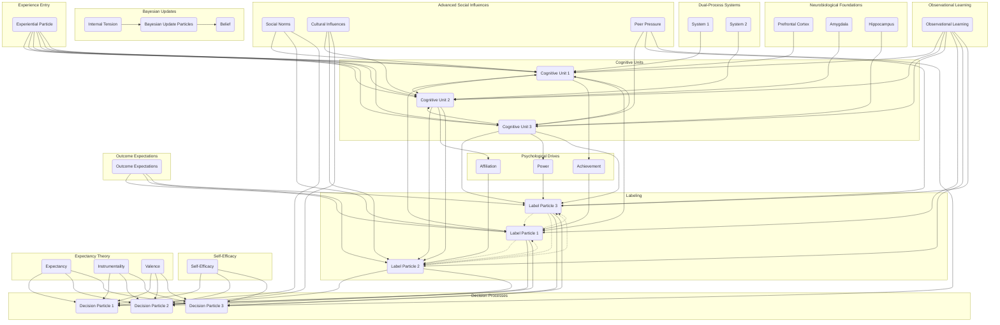

**USER**

particle interactions will be modeled as attractions and repulsions relative to field potentials, so there is plenty of space for dynamic behavior and feedback in this model. regarding neurobiology, maybe we can use clustering of functional roles as observed in neurobiology to set constraints on how components can or can't interact or the orders in which interaction/processing sequences should occur. re: dual-process, I think we can model this using particles that move at different speeds and which require different quantities of cognitive resources/load. we can probably ignore PCEC for now. and yes, particles representing decision policies and beliefs should incorporate some kind of bayesian update mechanism. Perhaps we could incorporate some kind of particle type responsible for performing these updates, so e.g. if an update is merited, that should be triggered by some kind of internal tension emitting an attractive force which recruits the particles that perform the update, which in turn (once attracted to the target belief above a critical threshold) recruit the necessary cognitive resources for effecting the update

**ASSISTANT**

### Enhanced Cognitive Immune Response Model with Particle Interactions and Bayesian Updates

To align the [[cognitive immune response model]] with modern cognitive science principles and incorporate dynamic interactions, we will represent particles interacting through attractions and repulsions relative to field potentials. We will also introduce constraints based on neurobiological clustering of functional roles and model dual-process systems with particles of different speeds and cognitive loads. Additionally, we will integrate a Bayesian update mechanism with specific particles responsible for performing these updates.

#### Key Enhancements

1. **Dynamic Interactions**: Particles will interact through attractive and repulsive forces relative to field potentials, enabling dynamic behavior and feedback.
2. **Neurobiological Constraints**: Clustering of functional roles will constrain interactions and processing sequences.
3. **Dual-Process Modeling**: Different particles will represent fast, low-resource processes (System 1) and slow, high-resource processes (System 2).
4. **Bayesian Updates**: Specific particles will handle belief and decision policy updates using Bayesian inference, triggered by internal tension.

### Model Components

1. **Experiential Particle (E_x)**: Represents incoming experiences or data.
2. **Cognitive Unit (C_x)**: Processes experiences, influenced by relevance and salience, constrained by neurobiological clustering.
3. **Labeling Particles (L_i)**: Represent judgments or labels, such as causal orientation or drive satisfaction.
4. **Decision Particles (D_j)**: Represent decisions influenced by dominating labels and social drives.
5. **Psychological Drives (P_D)**: Influence the attraction and labeling processes.
6. **Social Drives (S_D)**: Influence the attraction, labeling, and decision-making processes.
7. **Observational Learning (O_L)**: Influence cognitive units and labeling particles through modeling and imitation.
8. **Self-Efficacy (S_E)**: Influence decision particles based on belief in one's ability to perform the behavior.
9. **Outcome Expectations (O_E)**: Affect the attractiveness of labels and decisions based on anticipated outcomes.
10. **Expectancy Theory Components (E, I, V)**: Represent expectancy, instrumentality, and valence influencing decisions.
11. **Bayesian Update Particles (B_U)**: Responsible for updating beliefs and decision policies using Bayesian inference.
12. **Internal Tension (T)**: Represents cognitive load and triggers Bayesian updates.

### Interactions and Processes

1. **Attractions and Repulsions**:
   - Particles interact through fields, with attractions representing positive relevance or alignment and repulsions representing conflicts or irrelevance.
   - Mathematically, the force between particles \(i\) and \(j\) can be represented as:
     $$
     F_{ij} = k \frac{q_i q_j}{r_{ij}^2}
     $$
     where \( F_{ij} \) is the force, \( k \) is a constant, \( q_i \) and \( q_j \) are the charges (representing relevance/salience), and \( r_{ij} \) is the distance between particles.

2. **Neurobiological Constraints**:
   - Interactions and processing sequences are constrained by neurobiological clustering. For example, particles representing different cognitive functions are grouped based on brain region roles.
   - Specific pathways (sequences of interactions) are enforced to reflect realistic cognitive processing, such as sensory input being processed by perception units before reaching decision-making units.

3. **Dual-Process Systems**:
   - System 1 particles move quickly and require fewer cognitive resources, handling automatic, intuitive processes.
   - System 2 particles move slowly and consume more cognitive resources, handling deliberate, analytical processes.
   - The cognitive load (resources required) can be modeled as:
     $$
     R = \sum_{i} c_i
     $$
     where \( R \) is the total cognitive load and \( c_i \) are the resources required by each particle.

4. **Bayesian Updates**:
   - Internal tension \( T \) represents cognitive dissonance or load, emitting an attractive force to recruit Bayesian update particles \( B_U \).
   - When \( T \) exceeds a threshold, \( B_U \) particles are attracted to the target belief \( B \) to perform updates.
   - Bayesian update mechanism:
     $$
     P(H|E) = \frac{P(E|H) P(H)}{P(E)}
     $$
     where \( P(H|E) \) is the posterior probability, \( P(E|H) \) is the likelihood, \( P(H) \) is the prior probability, and \( P(E) \) is the evidence.

### Enhanced Graphical Model

Here is an updated mermaid diagram representing the enhanced model:

### Explanation and Empirical Alignment

- **Dynamic Interactions**: Particles interact through field potentials, enabling dynamic and feedback-driven behavior.
- **Neurobiological Constraints**: Functional clustering based on brain regions constrains interactions and processing sequences.
- **Dual-Process Systems**: Fast, low-resource System 1 particles and slow, high-resource System 2 particles model different cognitive processes.
- **Bayesian Updates**: Bayesian update particles handle belief and decision policy updates, triggered by internal tension.
- **Cognitive Load**: Represented as the sum of resources required by particles, influencing the availability and recruitment of cognitive resources.

### Conclusion

The enhanced [[cognitive immune response model]] incorporates dynamic interactions, neurobiological constraints, dual-process systems, and Bayesian updates to provide a comprehensive and empirically grounded framework. This model aligns with modern cognitive science principles and offers a robust basis

---

preceding: [[critique and alignment of the [[cognitive immune response model]] with modern cognitive science]]  

following: [[let's model labeling particles as units of attention, so there will always be some limit to the amount of information that can influence behavior, and attraction of attentional units will model salien]]

See also: [[decision-making processes]]

See also: [[cognitive dissonance]]

See also: [[cognitive load]]

See also: [[field potential]]

See also: [[cognitive immune response model]]

See also: [[cognitive resources]]