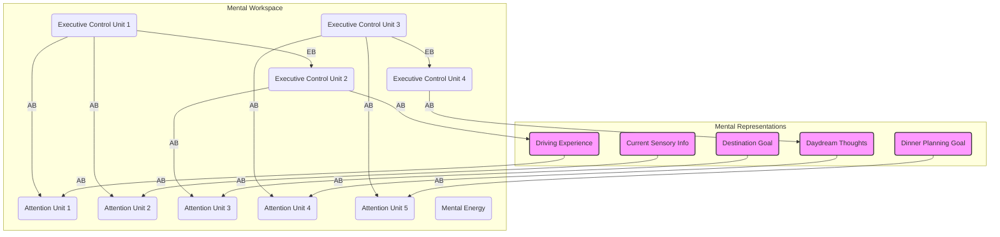

**USER**

let's say each ECU has two "attention binding (AB)" ports, and two "ECU binding (EB)" ports, and each MR has two ABs as well. ECUs attention units serve as bridges connecting ECUs to MRs. If an ECU wants to allocate more attention to a saturated MR, they need to recruit other ECUs which they will connect to through their respective available EB ports, and then the additional ECU can recruit more AUs through its unsaturated ports. this way ECUs can recruit additional executive resources for e.g. MRs that require a lot of attention and/or compute (reasoning)

**ASSISTANT**

### Enhanced Model with Attention Binding and ECU Binding Ports

To refine the particle-based cognitive model with the concept of attention binding (AB) ports and ECU binding (EB) ports, we will implement mechanisms for connecting ECUs and MRs through these ports. This will allow for dynamic allocation of attention units (AUs) and the recruitment of additional executive resources for complex or attention-demanding mental representations (MRs).

### Model Components

1. **Attention Units (AUs)**:
   - Represent units of attention.
   - Serve as bridges connecting ECUs to MRs.

2. **Mental Representations (MRs)**:
   - Represent various kinds of perceptual information, such as memories, current sensory phenomena, thoughts, and goals.
   - Each MR has two attention binding (AB) ports.

3. **Executive Control Units (ECUs)**:
   - Manage and allocate AUs to MRs.
   - Each ECU has two AB ports and two ECU binding (EB) ports.
   - ECUs can recruit additional ECUs through EB ports to manage high-demand MRs.

4. **Mental Energy (ME)**:
   - Represents the shared resource consumed by ECUs.
   - Depleted during ECU activity and renewed during inactivity.

### Interactions and Processes

1. **Attention Allocation**:
   - ECUs allocate AUs to MRs via AB ports.
   - If an MR's AB ports are saturated, the ECU must recruit another ECU through EB ports to allocate additional AUs.

2. **Recruitment of Additional ECUs**:
   - When an MR requires more attention or computational resources, an ECU can connect to another ECU via EB ports.
   - The newly recruited ECU can then allocate its AUs to the MR through its available AB ports.

3. **Energy Consumption and Renewal**:
   - Active ECUs consume mental energy while managing attention allocation.
   - Mental energy is renewed during periods of ECU inactivity.

### Example Scenario: Daydreaming While Driving

1. **Driving Goal**:
   - An ECU allocates AUs to MRs associated with driving experience and sensory information through AB ports.
   - If the driving-related MRs require more attention, the ECU recruits another ECU via EB ports to allocate additional AUs.

2. **Daydreaming Goal**:
   - Simultaneously, another ECU allocates AUs to MRs associated with daydreaming about "planning dinner tonight" through AB ports.
   - If the daydreaming-related MRs require more attention, this ECU also recruits another ECU through EB ports.

3. **Dynamic Allocation and Resource Management**:
   - The ECUs dynamically manage the allocation of AUs based on the demands of the MRs.
   - Shared mental energy resources constrain the number of ECUs that can be active simultaneously.

### Enhanced Graphical Model

Here is a mermaid diagram representing the enhanced model with AB and EB ports:

### Explanation and Empirical Alignment

- **Attention Units (AUs)**: Units of attention allocated by ECUs to MRs via AB ports.
- **Mental Representations (MRs)**: Perceptual information and goals attracting AUs through AB ports.
- **Executive Control Units (ECUs)**: Manage AUs and recruit additional ECUs via EB ports for high-demand MRs.
- **Mental Energy (ME)**: Shared resource consumed by ECUs during attention management and renewed during inactivity.

### Model Dynamics

1. **Attention Allocation**:
   - ECUs allocate AUs to MRs through AB ports based on salience and relevance.
   - Saturated MRs prompt ECUs to recruit additional ECUs through EB ports to allocate more AUs.

2. **Recruitment and Resource Management**:
   - ECUs dynamically recruit additional ECUs when needed to manage high-demand MRs.
   - The allocation and management of AUs are constrained by the shared mental energy resource.

3. **Energy Consumption and Renewal**:
   - Active ECUs consume mental energy, which is renewed during periods of inactivity.
   - Efficient management of ECUs and AUs ensures optimal use of cognitive resources.

### Conclusion

This enhanced model with attention binding (AB) and ECU binding (EB) ports provides a sophisticated framework for understanding attentional control and resource management in cognitive processes. By incorporating dynamic allocation, recruitment of additional executive resources, and energy consumption, the model aligns with modern cognitive theories and offers insights into how attention is controlled and directed in complex environments. For further exploration, consider reviewing related topics such as [[Executive Functions]], [[Attention and Working Memory]], and [[Mental Fatigue and Recovery]] within this vault.

---

preceding: [[enhanced model with executive control units (ecus) and attention allocation]]  

following: [[enhanced model with ecu topology and neighborhoods]]

See also: [[cognitive resources]]

See also: [[mental representations]]