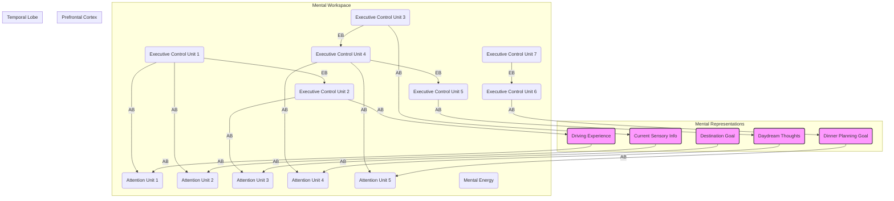

**USER**

maybe rather than just having the ECUs floating around, it would make sense to impose some sort of topology here, so maybe certain kinds of ECUs are only able to form connections with certain other kinds of ECUs. so like maybe we define some random graph over the ECUs which defines who their neighboring ECUs are, and any given ECU can only talk to its neighbors. The "mental energy" resource could be used to "activate" inter-ECU edges, so e.g. if two ECUs are collaborating to solve a problem that would require energy expenditure, and similarly if two ECUs were communicating because they were in conflict that would also require energy expenditure. the "freely moving ECUs" model would basically be equivalent to using a fully connected graph for the "reachable neighborhood" connectivity. using this neighborhood parameterization, maybe it might sense to carve out some regions of the ECU space that could correspond to specific neuroanatomical components?

**ASSISTANT**

### Enhanced Model with ECU Topology and Neighborhoods

To create a more structured and realistic model, we will impose a topology on the executive control units (ECUs) and define neighborhoods over which they can communicate. This topology will allow us to model specific neuroanatomical regions and introduce energy costs for activating inter-ECU edges, reflecting both collaboration and conflict resolution.

### Model Components

1. **Attention Units (AUs)**:
   - Represent units of attention.
   - Managed and allocated by ECUs to mental representations (MRs).

2. **Mental Representations (MRs)**:
   - Represent various kinds of perceptual information, such as memories, current sensory phenomena, thoughts, and goals.
   - Attract AUs based on relevance and salience.

3. **Executive Control Units (ECUs)**:
   - Manage and allocate AUs to MRs.
   - Connected in a defined topology, where each ECU can only communicate with its neighbors.
   - Consume mental energy for collaboration and conflict resolution.

4. **Mental Energy (ME)**:
   - Represents the shared resource consumed by ECUs.
   - Depleted during ECU activity, collaboration, and conflict resolution, and renewed during inactivity.

### Topology and Neighborhoods

1. **Random Graph Topology**:
   - Define a random graph over the ECUs, where edges represent possible communication pathways.
   - Each ECU has a fixed number of neighbors it can communicate with.

2. **Neuroanatomical Regions**:
   - Carve out regions of the ECU space corresponding to specific neuroanatomical components (e.g., prefrontal cortex, parietal lobe).
   - ECUs within a region are more densely connected to each other, reflecting localized processing.

### Interactions and Processes

1. **Attention Allocation**:
   - ECUs allocate AUs to MRs via attention binding (AB) ports.
   - If an MR's AB ports are saturated, the ECU must recruit another ECU through ECU binding (EB) ports to allocate additional AUs.

2. **Collaboration and Conflict Resolution**:
   - ECUs can collaborate or resolve conflicts by communicating with their neighbors.
   - Activating inter-ECU edges for communication requires mental energy.

3. **Energy Consumption and Renewal**:
   - Active ECUs consume mental energy while managing attention allocation and inter-ECU communication.
   - Mental energy is renewed during periods of ECU inactivity.

### Example Scenario: Daydreaming While Driving

1. **Driving Goal**:
   - An ECU in the prefrontal cortex allocates AUs to MRs associated with driving experience and sensory information.
   - If these MRs require more attention, the ECU recruits neighboring ECUs within the same region.

2. **Daydreaming Goal**:
   - Simultaneously, another ECU in a different region (e.g., temporal lobe) allocates AUs to MRs associated with daydreaming.
   - This ECU may also recruit neighboring ECUs within its region if needed.

3. **Dynamic Allocation and Resource Management**:
   - The ECUs dynamically manage the allocation of AUs and collaborate or resolve conflicts by communicating with their neighbors.
   - Shared mental energy resources constrain the number of active ECUs and their communication efforts.

### Enhanced Graphical Model

Here is a mermaid diagram representing the enhanced model with a defined topology:

### Explanation and Empirical Alignment

- **Attention Units (AUs)**: Units of attention allocated by ECUs to MRs via AB ports.
- **Mental Representations (MRs)**: Different types of perceptual information and goals attracting AUs through AB ports.
- **Executive Control Units (ECUs)**: Manage AUs and recruit additional ECUs via EB ports for high-demand MRs, connected in a defined topology.
- **Mental Energy (ME)**: Shared resource consumed by ECUs during attention management, collaboration, and conflict resolution, and renewed during inactivity.

### Model Dynamics

1. **Attention Allocation**:
   - ECUs allocate AUs to MRs through AB ports based on salience and relevance.
   - Saturated MRs prompt ECUs to recruit additional ECUs through EB ports to allocate more AUs.

2. **Collaboration and Conflict Resolution**:
   - ECUs dynamically recruit neighboring ECUs when needed to manage high-demand MRs or resolve conflicts.
   - Communication between ECUs is constrained by mental energy consumption.

3. **Energy Consumption and Renewal**:
   - Active ECUs consume mental energy, which is renewed during periods of inactivity.
   - Efficient management of ECUs and AUs ensures optimal use of cognitive resources.

4. **Topology and Neighborhoods**:
   - ECUs are connected in a random graph topology, with specific regions reflecting neuroanatomical components.
   - Each ECU can only communicate with its neighbors, imposing constraints on resource management and collaboration.

### Conclusion

By incorporating a defined topology and neighborhoods for ECUs, this enhanced model provides a sophisticated framework for understanding attentional control, resource management, and inter-ECU communication in cognitive processes. The dynamic interactions between ECUs, AUs, and MRs, along with the constraints imposed by mental energy and communication pathways, align with modern cognitive theories and offer insights into the complexities of multitasking and goal-oriented cognition. For further exploration, consider reviewing related topics such as [[Executive Functions]], [[Attention and Working Memory]], and [[Neural Connectivity]] within this vault.

---

preceding: [[enhanced model with attention binding and ecu binding ports]]  

following: [[proposed constraints on graph topology to represent neuroanatomical functional differentiation]]

See also: [[topology]]

See also: [[a topology]]

See also: [[cognitive resources]]

See also: [[mental representations]]