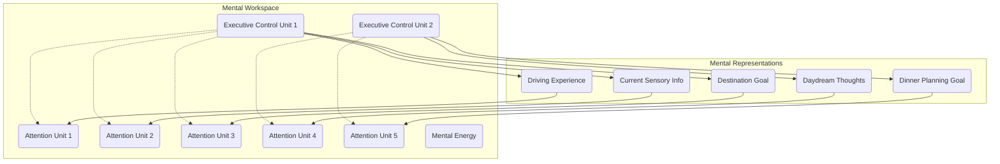

**USER**

i like your executive control unit (ECU) idea. let's change our model so attention particles aren't just floating randomly but are assigned to mental representations (MRs) by the ECUs. this way, both attention and ECUs will be interelated limited resources. we can also constrain the amount of attention units (AUs) any given ECU can manipulate at a given time. ECUs should consume some shared "mental energy" resource which is renewed during inactivity.

**ASSISTANT**

### Enhanced Model with Executive Control Units (ECUs) and Attention Allocation

To refine our particle-based cognitive model with executive control units (ECUs) managing attention particles (AUs), we will implement mechanisms for attentional allocation, resource constraints, and energy consumption. This model will reflect the dynamic and limited nature of cognitive resources, providing a comprehensive framework for understanding attention control and mental energy management.

### Relevant Cognitive and Psychological Theories

1. **Executive Functions**:
   - **Cognitive Control**: ECUs represent the brain's executive functions responsible for planning, attention allocation, and conflict resolution.
   - **Limited Resources**: Both attention and executive control are limited resources that must be managed efficiently.

2. **Attention and Working Memory**:
   - **Selective Attention**: ECUs allocate AUs to relevant mental representations based on goals and context.
   - **Capacity Constraints**: Each ECU can manipulate a limited number of AUs at a time, reflecting the capacity limits of working memory.

3. **Mental Energy and Fatigue**:
   - **Energy Consumption**: ECUs consume mental energy when active, which depletes and requires renewal during periods of inactivity.
   - **Renewal and Recovery**: Mental energy is replenished during rest, enabling ECUs to function effectively.

### Model Components

1. **Attention Units (AUs)**:
   - Represent units of attention.
   - Managed and allocated by ECUs to mental representations.

2. **Mental Representations (MRs)**:
   - Represent various kinds of perceptual information, such as memories, current sensory phenomena, thoughts, and goals.
   - Attract AUs based on relevance and salience.

3. **Executive Control Units (ECUs)**:
   - Manage and allocate AUs to MRs.
   - Limited in the number of AUs they can manipulate simultaneously.
   - Consume mental energy during activity.

4. **Mental Energy (ME)**:
   - Represents the shared resource consumed by ECUs.
   - Depleted during ECU activity and renewed during inactivity.

### Interactions and Processes

1. **Attention Allocation by ECUs**:
   - ECUs allocate AUs to MRs based on goals, relevance, and context.
   - The number of AUs an ECU can allocate is limited by its capacity.

2. **Energy Consumption and Renewal**:
   - ECUs consume mental energy while active.
   - Mental energy is renewed during periods of ECU inactivity.

### Example Scenario: Daydreaming While Driving

1. **Driving Goal**:
   - An ECU allocates AUs to MRs associated with driving experience and sensory information.
   - These MRs form an aggregated focus around the goal of "driving to a destination."

2. **Daydreaming Goal**:
   - Simultaneously, another ECU allocates AUs to MRs associated with daydreaming about "planning dinner tonight."
   - This forms a separate focus in the mental workspace.

3. **Split Attention and Resource Management**:
   - The limited number of AUs and the shared mental energy resource constrain the ECUs' ability to manage both goals effectively.
   - If one ECU consumes too much mental energy, it may need to enter a period of inactivity for recovery.

### Enhanced Graphical Model

Here is a mermaid diagram representing the enhanced model:

### Explanation and Empirical Alignment

- **Attention Units (AUs)**: Units of attention managed by ECUs, reflecting limited cognitive resources.
- **Mental Representations (MRs)**: Different types of perceptual information and goals that attract AUs.
- **Executive Control Units (ECUs)**: Manage and allocate AUs, constrained by capacity limits and consuming mental energy.
- **Mental Energy (ME)**: Shared resource consumed by ECUs, reflecting the mental energy required for executive functions.

### Model Dynamics

1. **Attention Allocation**:
   - ECUs allocate AUs to MRs based on the salience and relevance of the information.
   - The number of AUs an ECU can manipulate is limited by its capacity.

2. **Energy Consumption and Renewal**:
   - Active ECUs consume mental energy, depleting the shared resource.
   - Mental energy is renewed during periods of ECU inactivity, allowing for recovery.

3. **Split Attention and Cognitive Load**:
   - When ECUs manage multiple goals, the cognitive load increases, and the efficiency of attention allocation may decrease.
   - The balance of AUs and mental energy reflects the current distribution of cognitive resources and the ability to manage competing tasks.

### Conclusion

By incorporating executive control units (ECUs) and managing attention allocation and mental energy, this enhanced model provides a robust framework for understanding attentional control and resource management in cognitive processes. The dynamic interactions between ECUs, AUs, and MRs align with modern cognitive theories, offering insights into how attention is controlled and directed in complex environments. For further exploration, consider reviewing related topics such as [[Executive Functions]], [[Attention and Working Memory]], and [[Mental Fatigue and Recovery]] within this vault.

---

preceding: [[enhancing attentional control in the particle-based cognitive model]]  

following: [[enhanced model with attention binding and ecu binding ports]]

See also: [[executive function]]

See also: [[cognitive load]]

See also: [[cognitive resources]]

See also: [[working memory]]

See also: [[mental representations]]