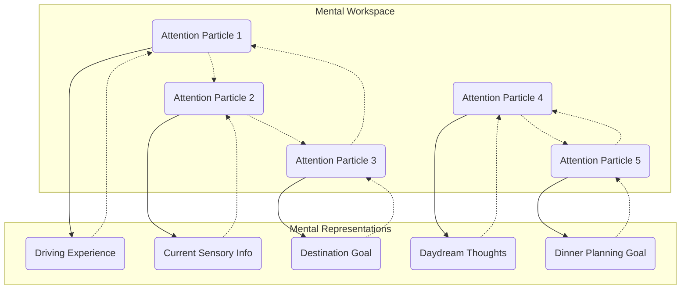

**USER**

how about this, let's instead say... we've got particles that represent units of attention, and we have mental representations, which are associated with various kinds of perceptual information like memories, current sensory phenomena, thoughts, etc. attentional units are attracted to these mental representations and recruited by them. let's call a "recruited" attentional unit "activated". activated attentional units will also attract each other, effectively  parameterizing the mental workspace as the collection of mental representations that are currently being attended to. 

let's consider someone day dreaming while driving. mental representations associated with past driving experience and heuristics will recruit and activate attention units, which will in turn attract the mental representations associated with the sensory information coming in from the current corporeal experience of driving the car and watching the road. let's say these mental representations aggregate around a mental representation of "driving to dome destination" goal. meanwhile, we have another mental representation associated with the daydream. for the sake of symmetry, let's say this is also associated with some kind of goal, maybe "plan dinner tonight". this goal manifests its own separate attractive region in the global workspace (split attention), recruiting attentional units for its purpose and thereby reducing the attentional units available for driving.

**ASSISTANT**

### Enhanced Particle-Based Model of Cognition: Attention and Mental Representations

To model cognition with particles representing units of attention and mental representations, we will define the interactions and dynamics of attentional units and mental representations in the mental workspace. This model will incorporate the recruitment and activation of attention, the aggregation of mental representations, and the parameterization of the mental workspace based on current cognitive activities.

### Relevant Cognitive and Psychological Theories

1. **Attention and Working Memory**:
   - **Limited Capacity**: Attention is a limited resource, and only a finite number of mental representations can be attended to at once.
   - **Selective Attention**: Attention selectively focuses on certain mental representations based on salience, relevance, and goals.

2. **Global Workspace Theory**:
   - **Global Workspace**: A mental framework where multiple mental representations compete for attention and integration.
   - **Broadcasting**: Activated representations in the global workspace can influence various cognitive processes.

3. **Dual-Task Interference**:
   - **Split Attention**: Dividing attention between tasks (e.g., driving and daydreaming) can reduce the resources available for each task, leading to performance decrements.

4. **Goal-Directed Behavior**:
   - **Goal Representation**: Mental representations are often associated with goals, guiding attention and cognitive resources towards achieving those goals.

### Model Components

1. **Attention Particles (A_x)**:
   - Represent units of attention.
   - Can be recruited and activated by mental representations.

2. **Mental Representations (M_x)**:
   - Represent various kinds of perceptual information, such as memories, sensory inputs, thoughts, and goals.
   - Attract attention particles based on salience and relevance.

3. **Activated Attention Units**:
   - Attention particles that have been recruited by mental representations.
   - Attract other activated attention units, forming clusters around mental representations.

### Interactions and Processes

1. **Recruitment of Attention**:
   - Mental representations attract attention particles.
   - The attraction force can be modeled as:
     $$
     F_{A_x, M_x} = k \frac{q_A q_M}{r_{A_x, M_x}^2}
     $$
     where \( F_{A_x, M_x} \) is the attraction force, \( q_A \) and \( q_M \) are the salience charges of the attention particle and mental representation, respectively, and \( r_{A_x, M_x} \) is the distance between them.

2. **Activation and Aggregation**:
   - Recruited attention particles become activated and form clusters around mental representations.
   - Activated attention units attract each other, parameterizing the mental workspace.
   - This clustering can be represented as:
     $$
     F_{A_x, A_y} = k \frac{q_A^2}{r_{A_x, A_y}^2}
     $$
     where \( F_{A_x, A_y} \) is the attraction force between activated attention units.

3. **Goal-Oriented Aggregation**:
   - Mental representations associated with specific goals form attractive regions in the mental workspace.
   - Attention units are divided based on goal relevance, leading to split attention.

### Example Scenario: Daydreaming While Driving

1. **Driving Goal**:
   - Mental representations associated with driving experience and sensory information attract attention particles.
   - These representations aggregate around the goal of "driving to a destination".

2. **Daydreaming Goal**:
   - Simultaneously, a mental representation associated with daydreaming about "planning dinner tonight" attracts attention particles.
   - This forms a separate attractive region in the mental workspace.

3. **Split Attention**:
   - The attentional units are divided between the driving-related representations and the daydream-related representations.
   - This split attention reduces the resources available for each task, potentially impacting driving performance.

### Enhanced Graphical Model

Here is a mermaid diagram representing the enhanced model:

### Explanation and Empirical Alignment

- **Attention Particles (A_x)**: Represent units of attention that are recruited and activated by mental representations.
- **Mental Representations (M_x)**: Represent different types of perceptual information and goals that attract attention particles.
- **Activated Attention Units**: Clusters of attention particles around mental representations, forming the mental workspace.

### Model Dynamics

1. **Attention Allocation**:
   - Attention particles are dynamically allocated based on the salience of mental representations.
   - Salient experiences and goals recruit more attention particles.

2. **Aggregation and Focus**:
   - Activated attention units cluster around relevant mental representations, forming areas of focus within the mental workspace.
   - Goal-oriented aggregation leads to distinct regions of focus for different tasks (e.g., driving vs. daydreaming).

3. **Split Attention and Cognitive Load**:
   - When attention is divided between multiple goals, the cognitive load increases, and performance on individual tasks may decrease.
   - The balance of attention particles between tasks reflects the current distribution of cognitive resources.

### Conclusion

This particle-based model of cognition, grounded in theories of attention, working memory, and goal-directed behavior, provides a comprehensive framework for understanding how mental representations compete for attention and influence behavior. The dynamic interactions between attention particles and mental representations align with modern cognitive theories, offering insights into the complexities of multitasking and goal-oriented cognition. For further exploration, consider reviewing related topics such as [[Attention and Working Memory]], [[Global Workspace Theory]], and [[Dual-Task Interference]] within this vault.

---

preceding: [[let's model labeling particles as units of attention, so there will always be some limit to the amount of information that can influence behavior, and attraction of attentional units will model salien]]  

following: [[enhancing attentional control in the particle-based cognitive model]]

See also: [[cognitive load]]

See also: [[split attention]]

See also: [[cognitive resources]]

See also: [[working memory]]

See also: [[mental representations]]