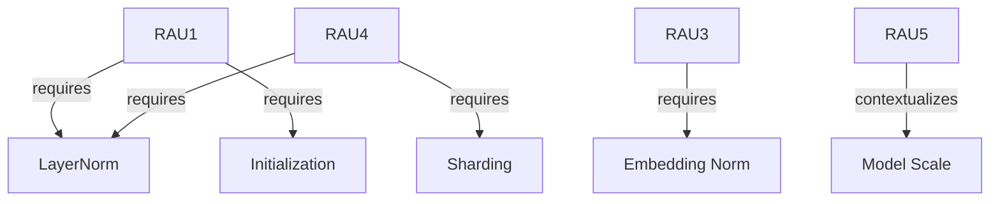

**USER**

propose improvements to address these weaknesses. implement your proposal on the motivating example, and re-critique.


**ASSISTANT**

# Enhanced Research Knowledge Graph Ontology

## Improved Schema

### [[Context-Aware RAU]]
```
RAU = (C, E, M, R, D, I)
where:
  D: Dependencies {required, optional}
  I: Implementation details
```

### [[Implementation Block]]
```
I = {
  code_basis: repository,
  critical_params: Map<param, sensitivity>,
  compute_requirements: {
    hardware: specs,
    time: duration,
    memory: requirements
  }
}
```

## Revised Example

### Transformer (2017)
```
RAU₁: {
  claim: "Self-attention mechanism sufficient for seq2seq",
  dependencies: {
    required: [
      "LayerNorm placement",
      "Careful initialization"
    ]
  },
  implementation: {
    code: "github.com/tensorflow/tensor2tensor",
    critical_params: {
      learning_rate: "high",
      warmup_steps: "critical",
      label_smoothing: "required"
    }
  }
}

RAU₂: {
  claim: "Parallel computation reduces training time",
  dependencies: {
    required: ["Sufficient GPU memory"],
    optional: ["Mixed precision"]
  }
}

RAU₃: {
  claim: "Positional encodings capture sequence order",
  dependencies: {
    required: ["Normalization of embeddings"]
  },
  implementation: {
    ablation_results: {
      learned_vs_fixed: "< 0.1% difference"
    }
  }
}
```

### PaLM (2022)
```
RAU₄: {
  claim: "Scaled attention patterns improve performance",
  dependencies: {
    required: [
      "Multi-query attention",
      "Careful sharding strategy"
    ]
  },
  implementation: {
    code: "github.com/google-research/palm",
    critical_params: {
      attention_partition: "hardware_dependent",
      compilation_strategy: "critical"
    }
  }
}

RAU₅: {
  claim: "Rotary embeddings superior for position",
  context: {
    scale: "1T parameters",
    architecture: "decoder_only"
  },
  implementation: {
    ablation_study: {
      methodology: "controlled_comparison",
      statistical_significance: "p < 0.01"
    }
  }
}
```

### [[Dependency Graph]]


## Re-critique

### Resolved Issues
1. Context tracking through explicit dependencies
2. Implementation details captured systematically
3. Ablation results and statistical significance included
4. Dependency graph guides granularity selection

### Remaining Challenges
1. [[Version Evolution]]: Need mechanism for tracking implementation improvements
2. [[Hardware Dependence]]: Better formalization needed for compute requirements
3. [[Statistical Rigor]]: Need standardized format for significance reporting
4. [[Reproduction Metadata]]: More structured capture of environmental details needed

The enhanced schema better captures the practical knowledge required for reproduction while maintaining theoretical insights.


---

preceding: [[example transformer evolution case study]]  


following: [[multi-source corroboration ontology]]