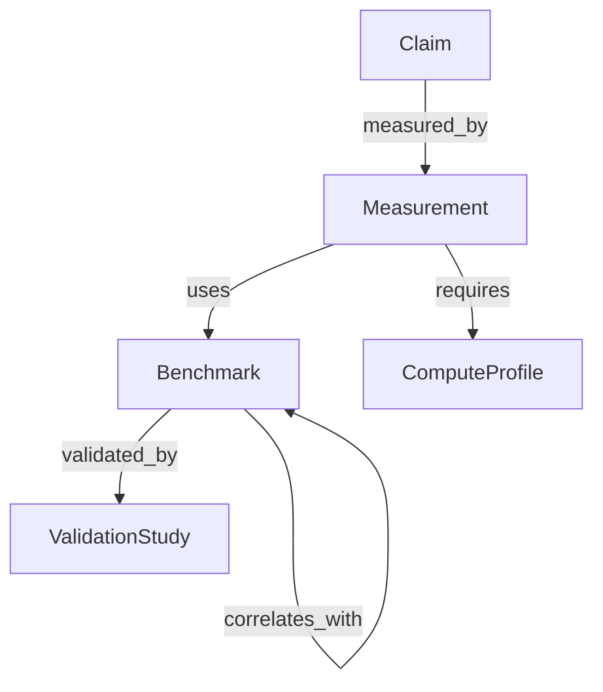

**USER**

propose improvements to address these weaknesses. implement your proposal on the motivating example, and re-critique.


**ASSISTANT**

# Enhanced Research Knowledge Graph Schema



## Case Study Implementation

```
Benchmarks: {
  ImageNet: {
    versions: ["2012", "Real", "v2"],
    correlations: {
      "ObjectNet": 0.72,
      "ImageNetV2": 0.89
    },
    validation_studies: [{
      paper: "Beyer2020",
      finding: "Resolution sensitivity",
      impact_factor: 0.8
    }],
    reliability_score: 0.85
  }
}

ComputeProfiles: {
  vit_training: {
    hardware: "TPUv3-512",
    hours: 2650,
    power_draw: "12.8kW",
    carbon_impact: "3.2tCO₂e",
    reproducibility_score: 0.7
  }
}

Claims: {
  vit_original: {
    statement: "Pure transformer viable for vision",
    measurements: [{
      benchmark: "ImageNet",
      metric: "Top-1",
      value: 88.55,
      compute_profile: "vit_training",
      reliability: min(
        benchmark.reliability_score,
        compute_profile.reproducibility_score
      )
    }]
  },
  
  maxvit_improvement: {
    statement: "Block-based attention more efficient",
    deprecates: {
      claim: "vit_original",
      dimension: "efficiency",
      evidence: {
        metric: "FLOPs/Accuracy",
        delta: "-47%",
        statistical_significance: "p < 0.01"
      }
    }
  }
}
```

## Improvements
1. Explicit benchmark correlations enable cross-validation
2. Standardized compute profiles track reproducibility
3. Multi-dimensional deprecation relationships
4. Reliability propagation through compute and benchmarks

## Remaining Challenges
1. Temporal evolution of benchmarks
2. Hardware-specific performance variations
3. Complex interaction effects between improvements


---

preceding: [[knowledge graph case study vision transformers]]  


following: [[theoretical knowledge graph schema]]

See also: [[research knowledge graph schema]]