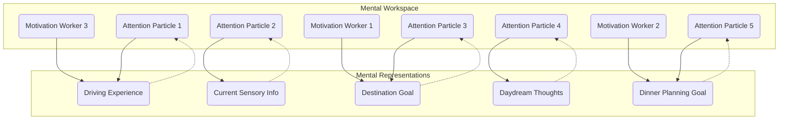
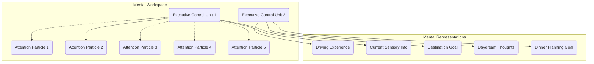
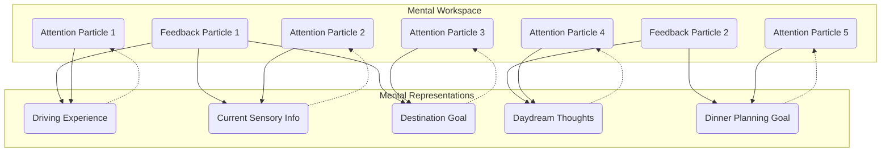

**USER**

propose three ideas for how we might incorporate some notion of "attentional control" in this system. maybe something like "motivation workers" that modulate the attractive and repulsive forces in the system... i'm not even sure if that's what's missing here. something's missing though.

**ASSISTANT**

### Enhancing Attentional Control in the Particle-Based Cognitive Model

To incorporate attentional control into the system, we need mechanisms that can dynamically modulate the allocation and focus of attention based on context, goals, and motivational states. Here are three ideas for how this can be achieved:

### 1. Motivation Workers

**Concept**: Introduce "motivation workers" that modulate the attractive and repulsive forces between attention particles and mental representations based on motivational states and goals.

**Implementation**:
- **Motivation Workers (M_W)**: Particles that influence the salience and relevance of mental representations.
- **Modulation of Forces**: Motivation workers adjust the attractive and repulsive forces between attention particles and mental representations based on current goals and motivational states.
- **Goal Relevance**: Motivation workers increase the salience of goal-relevant representations and decrease the salience of irrelevant distractions.

**Model Dynamics**:
- Motivation workers are attracted to mental representations associated with current goals.
- They modulate the \( q_M \) parameter in the force equation \( F_{A_x, M_x} = k \frac{q_A q_M}{r_{A_x, M_x}^2} \), increasing or decreasing the salience charge \( q_M \) based on goal relevance.
- Motivation workers can also introduce repulsive forces to reduce the attractiveness of distractors.

**Diagram**:

### 2. Executive Control Units

**Concept**: Introduce "executive control units" that dynamically allocate attentional resources and resolve conflicts between competing mental representations.

**Implementation**:
- **Executive Control Units (E_C)**: Special particles that monitor and manage the allocation of attention particles.
- **Conflict Resolution**: Executive control units identify conflicts between competing mental representations and allocate attention based on priority and task demands.
- **Resource Allocation**: These units can reallocate attention particles from less relevant tasks to more critical ones.

**Model Dynamics**:
- Executive control units monitor the activation levels of mental representations and the distribution of attention particles.
- They can intervene to redistribute attention particles, especially when there is a conflict or when task demands change.
- Executive control units can prioritize mental representations based on contextual factors and current goals.

**Diagram**:

### 3. Feedback Loops and Reward Systems

**Concept**: Implement feedback loops and reward systems that influence the allocation of attention based on performance and outcomes.

**Implementation**:
- **Feedback Particles (F_P)**: Particles that provide real-time feedback on task performance and outcomes.
- **Reward Systems**: Mechanisms that reinforce attention allocation to successful or goal-relevant tasks.
- **Dynamic Adjustment**: Feedback particles adjust the salience of mental representations based on past performance and current outcomes.

**Model Dynamics**:
- Feedback particles evaluate the effectiveness of attention allocation and provide feedback to adjust salience.
- Successful completion of tasks or progress towards goals increases the salience of relevant mental representations.
- Poor performance or distractions lead to a reduction in salience, encouraging reallocation of attention particles to more relevant tasks.

**Diagram**:

### Conclusion

These three ideas for incorporating attentional control—motivation workers, executive control units, and feedback loops with reward systems—provide mechanisms to dynamically modulate attention allocation and focus in the cognitive model. Each approach leverages different aspects of cognitive and motivational theories to enhance the system's ability to prioritize and manage attentional resources effectively. These enhancements align the model more closely with real-world cognitive processes, offering a robust framework for understanding how attention is controlled and directed in complex environments.

---

preceding: [[enhanced particle-based model of cognition attention and mental representations]]  

following: [[enhanced model with executive control units (ecus) and attention allocation]]

See also: [[attentional resources]]

See also: [[feedback loops]]

See also: [[mental representations]]