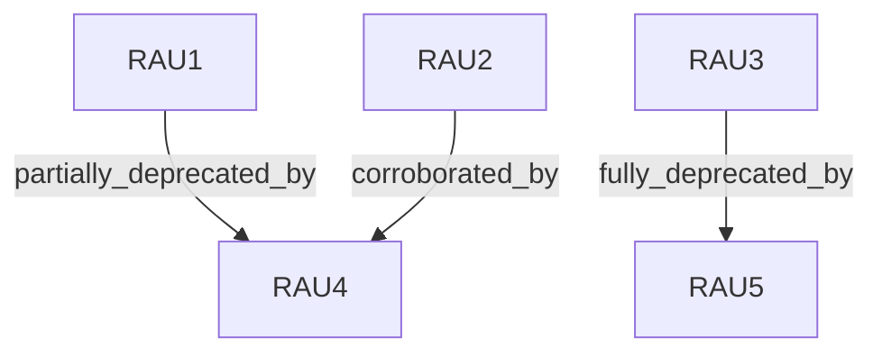

**USER**

consider a SOTA research article, and a formerly SOTA work which the newer work supercedes. Use concrete, real articles for these motivating examples. Demonstrate how these two articles factorize and interrelate using your  proposed system. Afterwards, critique the strengths and weaknesses of your approach in the context of this motivating example.


**ASSISTANT**

# Example: Transformer Evolution Case Study

## Article Decomposition 

### [[Attention Is All You Need]] (Vaswani et al., 2017)
Core RAUs:
```
RAU₁: {
  claim: "Self-attention mechanism sufficient for seq2seq",
  evidence: {
    methodology: "Transformer architecture",
    metrics: {
      WMT2014: [En-Fr: 41.8 BLEU, En-De: 28.4 BLEU],
      training_time: "3.5 days on 8 P100s"
    }
  }
}

RAU₂: {
  claim: "Parallel computation reduces training time",
  evidence: {
    methodology: "Attention vs RNN comparison",
    metrics: {
      speedup: "3.5x vs SOTA RNN"
    }
  }
}

RAU₃: {
  claim: "Positional encodings capture sequence order",
  evidence: {
    methodology: "Sinusoidal vs learned encodings",
    result: "Comparable performance"
  }
}
```

### [[PaLM: Scaling Language Modeling with Pathways]] (Chowdhery et al., 2022) 
Core RAUs:
```
RAU₄: {
  claim: "Scaled attention patterns improve performance",
  evidence: {
    methodology: "Multi-query attention",
    metrics: {
      speedup: "2.5x vs vanilla attention"
    }
  },
  deprecates: RAU₁.implementation
}

RAU₅: {
  claim: "Rotary embeddings superior for position",
  evidence: {
    methodology: "RoPE vs sinusoidal comparison",
    metrics: {
      perplexity_delta: "-0.4"
    }
  },
  deprecates: RAU₃
}
```

## [[Evidence Graph]]


## Critique

### Strengths
1. [[Granular Deprecation]]: Identifies that PaLM supersedes specific Transformer components while validating others
2. [[Evidence Chaining]]: Tracks evolution of architectural choices
3. [[Metric Preservation]]: Maintains concrete performance numbers for comparison

### Weaknesses
1. [[Context Loss]]: Difficult to capture interaction effects between components
2. [[Implementation Details]]: Current schema may not sufficiently capture critical engineering decisions
3. [[Metric Comparability]]: Different evaluation methodologies complicate direct comparison
4. [[Granularity Selection]]: No clear principle for choosing decomposition level

The example demonstrates both the potential utility in tracking partial supersession of research and the challenges in fully capturing the nuanced relationships between research contributions.


---

preceding: [[research knowledge graph ontology for mldl literature]]  


following: [[enhanced research knowledge graph ontology]]