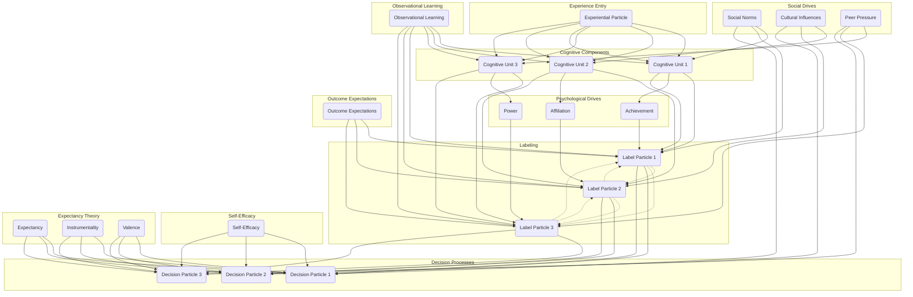

**USER**

expectancy theory

**ASSISTANT**

**Expectancy Theory** is a psychological theory of motivation that explains how individuals decide to exert effort based on their expectations of outcomes. Proposed by Victor Vroom in 1964, this theory suggests that people are motivated to act in ways that lead to desirable outcomes and avoid those that lead to unfavorable ones. It highlights the cognitive processes involved in making decisions related to effort, performance, and reward, providing a framework for understanding workplace motivation, educational engagement, and economic behaviors.

### Core Components of Expectancy Theory

Expectancy Theory comprises three key elements:

1. **Expectancy (E → P)**:
   - **Definition**: The belief or perception that one's effort will lead to successful performance. It represents the strength of the association between effort and performance.
   - **Example**: An employee may think, "If I work harder, I will complete this project successfully." The level of **expectancy** is influenced by factors such as the individual's self-efficacy, skill level, resources, past experiences, and perceived difficulty of the task.
   - **Mathematical Representation**: Expectancy is typically expressed as a probability ranging from 0 (no chance of success) to 1 (certain success).

2. **Instrumentality (P → O)**:
   - **Definition**: The belief that successful performance will result in a specific outcome or reward. It reflects the individual's assessment of the likelihood that performance will be recognized and rewarded.
   - **Example**: The employee considers, "If I complete this project successfully, I will receive a bonus." **Instrumentality** is influenced by organizational policies, fairness, transparency in reward systems, and trust in management.
   - **Mathematical Representation**: Instrumentality is also expressed as a probability between 0 (no chance of reward) and 1 (certain reward) depending on the perceived reliability of the reward system.

3. **Valence (V)**:
   - **Definition**: The value or attractiveness of the reward to the individual. Valence represents the subjective worth of the outcome, which can be positive (desirable reward), negative (undesirable outcome), or neutral.
   - **Example**: The employee considers how much they value the bonus or other rewards. High valence means the individual highly values the reward, while low or negative valence means they do not value it or may even find it undesirable.
   - **Mathematical Representation**: Valence can be assigned a numerical value reflecting the individual’s preference, where positive values indicate desired outcomes and negative values indicate aversion.

### Expectancy Theory Formula

The overall motivational force (MF) for a given action or task can be expressed using the formula:

$$
MF = E \times I \times V,
$$

where:
- \( E \) is the **expectancy** (the perceived probability that effort will lead to performance).
- \( I \) is the **instrumentality** (the perceived probability that performance will lead to the desired outcome).
- \( V \) is the **valence** (the subjective value of the outcome).

This multiplicative relationship implies that motivation will be zero if any of the three components is zero. In other words, for motivation to be high, individuals must:
- Believe that they can achieve the desired performance level (\( E > 0 \)),
- Believe that successful performance will lead to rewards (\( I > 0 \)),
- Value the rewards highly (\( V > 0 \)).

### Application of Expectancy Theory

1. **Workplace Motivation**:
   - **Example**: In a corporate environment, an employee might decide to work overtime to meet a project deadline. According to Expectancy Theory, their decision is based on their belief in their capability to complete the task (high expectancy), their trust that the extra effort will be recognized and rewarded (high instrumentality), and the value they place on the reward (e.g., a bonus, promotion).
   - **Implications for Management**: To enhance motivation, managers should:
     - Increase **expectancy** by providing adequate resources, training, and support.
     - Enhance **instrumentality** by ensuring a transparent and fair reward system.
     - Improve **valence** by offering rewards that align with the employee’s values and needs.

2. **Education**:
   - **Example**: A student’s motivation to study for an exam depends on their belief in their ability to learn the material and perform well (expectancy), their perception that good grades will lead to positive outcomes like scholarships or praise (instrumentality), and the importance they place on those outcomes (valence).
   - **Implications for Educators**: Teachers can increase student motivation by helping them build confidence (enhancing expectancy), clearly connecting effort with outcomes (reinforcing instrumentality), and recognizing the individual goals and values of students (addressing valence).

3. **Economic Behavior**:
   - **Example**: In economic decision-making, consumers are more likely to purchase a product if they believe their investment (effort) will provide the desired benefits (instrumentality) and if those benefits are valuable to them (valence).
   - **Implications for Marketing**: Marketers can influence expectancy by providing information that builds consumer confidence in product effectiveness, and they can enhance the perceived value of the product (valence) through branding and advertising.

### Extensions and Integrations with Other Theories

1. **Goal-Setting Theory**: Expectancy Theory can complement **Goal-Setting Theory**, which emphasizes the importance of setting specific, challenging, and attainable goals. Goal-Setting Theory affects the expectancy component by providing clarity and structure, enhancing the individual's belief that effort will lead to successful performance.

2. **Equity Theory**: While Expectancy Theory focuses on the cognitive assessment of the effort-reward relationship, **Equity Theory** introduces social comparison and fairness considerations. Together, they explain not only the motivation to pursue a goal but also the emotional responses to perceived inequities in rewards.

3. **Self-Determination Theory (SDT)**: SDT distinguishes between intrinsic and extrinsic motivation. Expectancy Theory primarily deals with extrinsic motivation (e.g., rewards), while SDT explores how intrinsic motivation (e.g., personal growth, autonomy) influences the perception of valence.

### Criticisms and Limitations of Expectancy Theory

1. **Complexity of Human Motivation**: The theory’s cognitive approach might oversimplify the complexity of human motivation by reducing it to a series of rational calculations. Emotional, unconscious, or habitual factors can also drive behavior, which Expectancy Theory does not fully account for.

2. **Overemphasis on Rationality**: Expectancy Theory assumes that individuals act rationally in evaluating expectancy, instrumentality, and valence. However, in real-life situations, people may be influenced by biases, emotions, or social pressures, leading to decisions that do not conform to purely rational models.

3. **Measurement Challenges**: Assessing expectancy, instrumentality, and valence can be subjective and context-dependent. Different individuals may have varying perceptions of the same task, making it difficult to generalize motivational factors across people or situations.

### Summary

**Expectancy Theory** provides a comprehensive framework for understanding motivation by integrating cognitive evaluations of effort, performance, and reward. It emphasizes that individuals will be motivated when they:
1. Believe they can successfully perform a task,
2. Trust that successful performance will lead to valuable rewards,
3. Highly value those rewards.

This model has been widely used in workplace management, education, and economic behavior, offering actionable insights into how to structure environments and incentives to maximize motivation. Despite its limitations, Expectancy Theory remains a central tool for explaining how people make decisions related to effort and achievement.

---

preceding: [[effort-reward relationship]]  

following: [[equity theory]]---
date: 1720980891.298709
tags:
- autogenerated
- source__oai
- conversation_id__9f098b1c-fdb5-4bcf-aefb-0cf9de928542
- msg_aaa26f8d-47ed-4743-b757-86e9d7e2d6b9
- msg_0a1f6c80-0f4d-4320-8419-27bec8605891
title: expectancy theory
---

**USER**

Expectancy Theory

**ASSISTANT**

### Expectancy Theory

Expectancy Theory, developed by [[Victor Vroom]], is a motivational theory that explains how individuals make decisions based on their expectations of desired outcomes. The theory posits that individuals are motivated to act in certain ways based on the expected results of their actions, which are influenced by three key components: expectancy, instrumentality, and valence.

### Key Components of Expectancy Theory

1. **Expectancy (E)**:
   - **Definition**: The belief that one's effort will result in successful performance.
   - **Factors Influencing Expectancy**:
     - **Self-Efficacy**: Belief in one's ability to perform a task.
     - **Goal Difficulty**: Perceived difficulty of achieving the task.
     - **Control**: Degree to which one feels in control of the outcome.

2. **Instrumentality (I)**:
   - **Definition**: The belief that successful performance will lead to desired rewards or outcomes.
   - **Factors Influencing Instrumentality**:
     - **Trust**: Belief that the reward will be given as promised.
     - **Policies**: Organizational policies linking performance to rewards.
     - **Clarity**: Clear understanding of the link between performance and outcomes.

3. **Valence (V)**:
   - **Definition**: The value an individual places on the rewards or outcomes.
   - **Factors Influencing Valence**:
     - **Needs**: Alignment with personal needs and goals.
     - **Preferences**: Personal preference for certain rewards.
     - **Values**: Alignment with personal values and beliefs.

### Mathematical Representation

The motivational force (MF) in Expectancy Theory can be represented mathematically as:

$$
MF = E \times I \times V
$$

where:
- \( MF \) is the motivational force.
- \( E \) is the expectancy.
- \( I \) is the instrumentality.
- \( V \) is the valence.

### Integrating Expectancy Theory into the Cognitive Immune Response Model

To integrate Expectancy Theory into the [[cognitive immune response model]], we can incorporate the concepts of expectancy, instrumentality, and valence into the decision-making processes and labeling particles.

#### Modified Model Components

1. **Experiential Particle (E_x)**: Represents an incoming experience or data.
2. **Cognitive Unit (C_x)**: Represents cognitive components that process the experience based on relevance and salience.
3. **Labeling Particles (L_i)**: Represent judgments or labels assigned to experiences, such as causal orientation or drive satisfaction.
4. **Decision Particles (D_j)**: Represent particles involved in decision-making processes, recruited based on the dominating labels.
5. **Psychological Drives (P_D)**: Influence the attraction and labeling processes.
6. **Social Drives (S_D)**: Influence the attraction, labeling, and decision-making processes.
7. **Observational Learning (O_L)**: Influences cognitive units and labeling particles through modeling and imitation.
8. **Self-Efficacy (S_E)**: Influences decision particles based on the belief in one's ability to perform the behavior.
9. **Outcome Expectations (O_E)**: Affect the attractiveness of labels and decisions based on anticipated outcomes.
10. **Expectancy (E)**: Belief that effort will result in performance.
11. **Instrumentality (I)**: Belief that performance will lead to rewards.
12. **Valence (V)**: Value placed on the rewards.

### Enhanced Graphical Model

Here is an updated mermaid diagram representing the integration of Expectancy Theory:

### Explanation and Empirical Alignment

- **Experiential Particle (E_x)**: Represents incoming sensory input or external stimuli.
- **Cognitive Units (C_x)**: Neural or cognitive modules activated by relevance, salience, and [[psychological drives]].
- **Labeling Particles (L_i)**: Judgments formed through cognitive appraisal processes, influenced by psychological and social drives.
- **Decision Particles (D_j)**: Decision-making nodes influenced by the dominant labels, social drives, self-efficacy, and expectancy factors.
- **Psychological Drives (P_D)**: Represent innate and learned motivations influencing cognitive and labeling processes.
- **Social Drives (S_D)**: Represent social influences affecting cognitive, labeling, and decision-making processes.
- **Observational Learning (O_L)**: Learning through observing others, influencing cognitive units and labeling particles.
- **Self-Efficacy (S_E)**: Belief in one's ability to execute behaviors, influencing decision-making processes.
- **Outcome Expectations (O_E)**: Beliefs about the outcomes of behaviors, affecting the attractiveness of labels and decisions.
- **Expectancy (E)**: Belief that effort will result in performance, influencing decision particles.
- **Instrumentality (I)**: Belief that performance will lead to rewards, influencing decision particles.
- **Valence (V)**: Value placed on the rewards, influencing decision particles.

### Empirical Foundations and Applications

1. **Expectancy**: Research shows that individuals are more motivated when they believe their efforts will lead to successful performance (e.g., [[Self-Efficacy Theory]]).
2. **Instrumentality**: Studies indicate that clear links between performance and rewards enhance motivation (e.g., [[Equity Theory]]).
3. **Valence**: Findings suggest that individuals are motivated by rewards they value and that align with their needs and goals (e.g., [[Maslow's Hierarchy of Needs]]).

### Conclusion

By integrating Expectancy Theory into the [[cognitive immune response model]], we create a comprehensive framework that accounts for the complex interplay between cognitive, emotional, psychological, and social factors. This enhanced model aligns with empirical research and provides a robust basis for understanding how expectations of outcomes influence behavior. For further exploration, consider reviewing related topics such as [[Self-Efficacy Theory]], [[Equity Theory]], and [[Maslow's Hierarchy of Needs]] within this vault.

---

preceding: [[social cognitive theory]]  

following: [[critique and alignment of the [[cognitive immune response model]] with modern cognitive science]]

See also: [[perceived value]]

See also: [[decision-making processes]]

See also: [[intrinsic motivation]]

See also: [[vroom's expectancy theory]]

See also: [[social influence]]

See also: [[administrative theory]]

See also: [[herzberg's two-factor theory]]

See also: [[extrinsic motivation]]