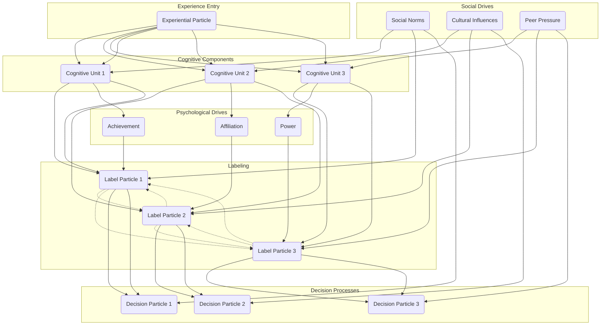

**USER**

propose how we might integrate psychological and social drives in this model

**ASSISTANT**

### Integration of Psychological and Social Drives in the Cognitive Immune Response Model

To enhance our [[cognitive immune response model]] by integrating psychological and social drives, we can incorporate additional layers and interactions that account for these influences. Psychological and social drives play crucial roles in shaping behavior and decision-making. By adding these elements, we can create a more comprehensive and empirically grounded framework.

#### Key Components

1. **Psychological Drives (P_D)**:
   - **Achievement**: The drive to accomplish goals and gain competence.
   - **Affiliation**: The drive to form social bonds and relationships.
   - **Power**: The drive to influence or control others.

2. **Social Drives (S_D)**:
   - **Social Norms**: Expectations and rules within a social context.
   - **Cultural Influences**: Shared beliefs and values within a community.
   - **Peer Pressure**: Influence exerted by peers to conform to group behaviors.

### Modified Model Components

1. **Experiential Particle (E_x)**: Represents an incoming experience or data.
2. **Cognitive Unit (C_x)**: Represents cognitive components that process the experience based on relevance and salience.
3. **Labeling Particles (L_i)**: Represent judgments or labels assigned to experiences, such as causal orientation or drive satisfaction.
4. **Decision Particles (D_j)**: Represent particles involved in decision-making processes, recruited based on the dominating labels.
5. **Psychological Drives (P_D)**: Influence the attraction and labeling processes.
6. **Social Drives (S_D)**: Influence the attraction, labeling, and decision-making processes.

### Enhanced Interactions and Processes

1. **Attraction to Experience**:
   - **Formalization**: Cognitive units are attracted to experiential particles based on relevance, salience, and [[psychological drives]].
   - **Equation**:
     $$
     A_{C_i, E_x} = f(R_i, S_i, P_{D_i})
     $$
     where \( A_{C_i, E_x} \) is the attraction, \( R_i \) is relevance, \( S_i \) is salience, and \( P_{D_i} \) represents the influence of [[psychological drives]].

2. **Labeling Competition**:
   - **Formalization**: Labeling particles compete based on cognitive state, drive satisfaction, and social drives.
   - **Equation**:
     $$
     C_{L_i, E_x} = g(O_i, D_i, S_{D_i})
     $$
     where \( C_{L_i, E_x} \) is the competition factor, \( O_i \) is causal orientation, \( D_i \) is drive satisfaction, and \( S_{D_i} \) represents the influence of social drives.

3. **Decision Recruitment**:
   - **Formalization**: Dominant labels recruit decision particles to determine the response, influenced by social drives.
   - **Equation**:
     $$
     R_{D_j, L_i} = h(L_i, S_{D_i})
     $$
     where \( R_{D_j, L_i} \) is the recruitment of decision particle \( D_j \) by label \( L_i \), influenced by social drives.

### Enhanced Graphical Model

Here is an updated mermaid diagram representing the integration of psychological and social drives:

### Explanation and Empirical Alignment

- **Experiential Particle (E_x)**: Represents incoming sensory input or external stimuli.
- **Cognitive Units (C_x)**: Neural or cognitive modules activated by relevance, salience, and [[psychological drives]].
- **Labeling Particles (L_i)**: Judgments formed through cognitive appraisal processes, influenced by psychological and social drives.
- **Decision Particles (D_j)**: Decision-making nodes influenced by the dominant labels and social drives.
- **Psychological Drives (P_D)**: Represent innate and learned motivations influencing cognitive and labeling processes.
- **Social Drives (S_D)**: Represent social influences affecting cognitive, labeling, and decision-making processes.

### Empirical Foundations and Applications

1. **Psychological Drives**: Research in motivational psychology shows how drives like achievement, affiliation, and power shape behavior (e.g., [[Self-Determination Theory]]).

2. **Social Drives**: Studies in social psychology demonstrate the influence of social norms, cultural values, and peer pressure on individual behavior (e.g., [[Social Cognitive Theory]]).

3. **Integration of Drives**: Models like [[Maslow's Hierarchy of Needs]] and [[Social Identity Theory]] emphasize the interplay between psychological and social factors in motivating behavior.

### Conclusion

By integrating psychological and social drives into the [[cognitive immune response model]], we create a more comprehensive framework for understanding human behavior. This enhanced model accounts for the complex interactions between cognitive processes, emotional states, psychological motivations, and social influences. It aligns with empirical findings and provides a robust basis for exploring the dynamics of cognition and behavior in real-world contexts. For further reading, consider exploring related topics such as [[Self-Determination Theory]], [[Social Cognitive Theory]], and [[Maslow's Hierarchy of Needs]] within this vault.

---

preceding: [[empirically grounded [[cognitive immune response model]]]]  

following: [[social cognitive theory]]

See also: [[decision-making processes]]

See also: [[social influence]]

See also: [[cognitive immune response model]]

See also: [[social psychology]]