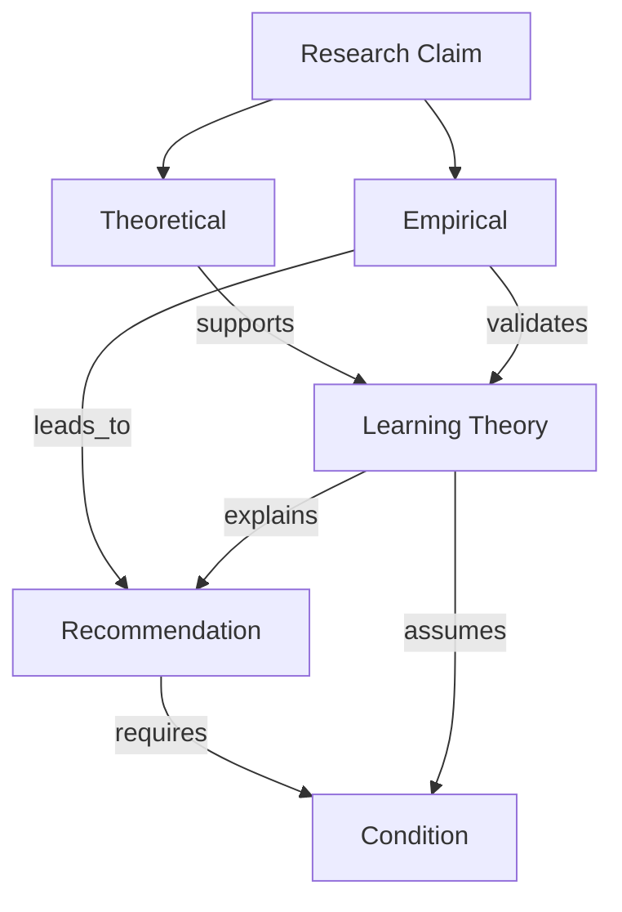

**USER**

let's marry empirical and theoretical claims into a unified schema. My main interest here is in tracking the state of the art with respect to actionable recommendations for training, and our current theoretical understanding of why learning dynamics operate the way they do.


**ASSISTANT**



```
UnifiedClaim = {
  theoretical: {
    statement: String,
    assumptions: Set<Condition>,
    proof: Option<Proof>,
    explains: Set<EmpiricalClaim>
  },
  
  empirical: {
    statement: String,
    measurements: Set<Measurement>,
    conditions: Set<Condition>,
    validates: Set<TheoreticalClaim>
  },
  
  recommendation: {
    practice: String,
    conditions: Set<Condition>,
    theoretical_basis: Set<TheoreticalClaim>,
    empirical_evidence: Set<EmpiricalClaim>,
    confidence: Float
  }
}
```

Example:
```
claim: {
  empirical: {
    statement: "Learning rate warmup improves stability",
    measurements: [{
      benchmark: "ImageNet",
      metric: "Training Success Rate",
      value: "+15%"
    }],
    conditions: ["Batch Normalization", "Large Batch Size"]
  },
  
  theoretical: {
    statement: "Warmup controls gradient variance",
    proof: {
      key_steps: ["Gradient second moment bound"],
      assumptions: ["Lipschitz gradients"]
    }
  },
  
  recommendation: {
    practice: "Use linear warmup for first 5% of training",
    confidence: 0.9,
    conditions: {
      required: ["Batch Normalization"],
      optional: ["Large Batch"]
    }
  }
}
```

This unifies empirical measurements, theoretical understanding, and practical recommendations while tracking their interdependencies and limitations.


---

preceding: [[theoretical knowledge graph schema]]  


following: [[are there any publicly available knowledge stores which factorize information in a manner similar to that which we've discussed]]