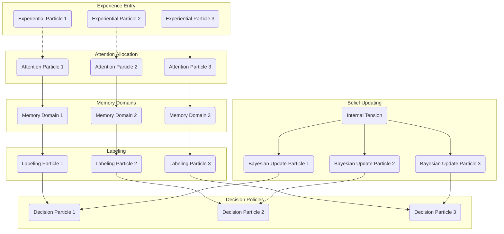

**ASSISTANT**

for understanding the complex dynamics of cognition and behavior. For further exploration, consider reviewing related topics such as [[Bayesian Inference]], [[Cognitive Load Theory]], and [[Neural Plasticity]] within this vault.

**USER**

let's model labeling particles as units of attention, so there will always be some limit to the amount of information that can influence behavior, and attraction of attentional units will model salience. attention units will then in turn be attracted to memory domains that are associated with labels and policies. memory represents stored knowledge like past experiences, values, goals, and decision heuristics that influence how experiences will be labeled. 

disregard the old model and start from scratch with this new model, starting by discussing the relevant cognitive/psychological theories in which our particle-based model of cognition is grounded

**ASSISTANT**

### Grounding the Particle-Based Model of Cognition

To build a particle-based model of cognition that is grounded in modern cognitive and psychological theories, we need to incorporate principles from several key areas of research:

1. **Attention and Salience**:
   - **Attention**: Attention is the cognitive process of selectively concentrating on specific information while ignoring other perceivable information. Limited attentional resources mean that only a subset of available information can influence behavior at any given time.
   - **Salience**: Salience refers to how much a particular piece of information stands out and captures attention. This is influenced by factors such as novelty, relevance to current goals, and emotional impact.

2. **Memory and Knowledge Representation**:
   - **Working Memory**: A temporary storage system that holds information currently being processed or used. It has a limited capacity and is critical for decision-making and problem-solving.
   - **Long-Term Memory**: A more permanent storage system that holds accumulated knowledge, past experiences, values, goals, and heuristics. It influences how new experiences are interpreted and labeled.

3. **Decision-Making and Heuristics**:
   - **Heuristics**: Mental shortcuts or rules of thumb that simplify decision-making processes. They are often based on past experiences and stored in long-term memory.
   - **Dual-Process Theory**: This theory posits two systems of thinking: System 1, which is fast and automatic, and System 2, which is slow and deliberate. The allocation of attention and resources between these systems is critical for decision-making.

4. **Motivation and Drives**:
   - **Intrinsic and Extrinsic Motivation**: Motivation can be driven by internal factors (intrinsic) such as personal goals and values, or by external factors (extrinsic) such as rewards and social pressures.

5. **Bayesian Inference**:
   - **Belief Updating**: The process of updating beliefs based on new evidence, typically modeled using Bayesian inference. This involves adjusting the probability of a belief being true based on the likelihood of observed evidence.

### New Particle-Based Model of Cognition

Based on these theories, we will design a model where particles represent units of attention, memory domains, and decision policies. These particles interact dynamically to influence behavior.

#### Model Components

1. **Attention Particles (A_x)**:
   - Represent units of attention that focus on salient information.
   - Limited in number, reflecting the constraints of working memory.
   - Attraction to experiences is based on salience.

2. **Experiential Particles (E_x)**:
   - Represent incoming experiences or data.
   - Compete for attention particles based on their salience.

3. **Memory Domains (M_x)**:
   - Represent long-term memory storage of past experiences, values, goals, and heuristics.
   - Attract attention particles associated with relevant experiences and labels.

4. **Labeling Particles (L_x)**:
   - Represent judgments or labels assigned to experiences, such as relevance to goals or emotional impact.
   - Influence the attraction of attention particles to memory domains.

5. **Decision Policy Particles (D_x)**:
   - Represent decision-making rules and heuristics.
   - Attracted to labeled experiences and influence behavior.

6. **Bayesian Update Particles (B_x)**:
   - Responsible for updating beliefs and decision policies based on new evidence.
   - Triggered by internal tension or conflict, attracting attention particles to the belief updating process.

### Interactions and Processes

1. **Attention Allocation**:
   - Attention particles are attracted to experiential particles based on salience.
   - Salience is influenced by novelty, relevance, and emotional impact.

2. **Memory Activation**:
   - Attention particles, when attracted to experiences, in turn attract memory domains associated with relevant labels and policies.
   - Memory domains influence how experiences are labeled based on stored knowledge and past experiences.

3. **Labeling and Decision-Making**:
   - Labeling particles are influenced by activated memory domains, assigning judgments to experiences.
   - Decision policy particles are then attracted to these labeled experiences, guiding behavior.

4. **Belief Updating**:
   - Internal tension, representing cognitive dissonance or conflict, emits an attractive force recruiting Bayesian update particles.
   - These particles perform belief updates when new evidence warrants it, adjusting the probability of beliefs and influencing future decisions.

### Enhanced Graphical Model

Here is a mermaid diagram representing the new model:

### Explanation and Empirical Alignment

- **Attention Allocation**: Attention particles allocate limited cognitive resources to the most salient experiences, reflecting theories of attention and working memory.
- **Memory Activation**: Activated memory domains represent long-term memory influences, including past experiences and heuristics, in line with knowledge representation theories.
- **Labeling and Decision-Making**: Labeling particles assign judgments to experiences based on activated memory domains, guiding decision policies and behavior.
- **Belief Updating**: Bayesian update particles adjust beliefs based on new evidence, triggered by internal tension, consistent with Bayesian inference models.

### Conclusion

This particle-based model of cognition integrates principles from attention, memory, decision-making, and belief updating to provide a comprehensive framework for understanding cognitive processes. By modeling dynamic interactions and constraints, it aligns with modern cognitive and psychological theories, offering insights into how experiences are processed and influence behavior. For further exploration, consider reviewing related topics such as [[Attention and Working Memory]], [[Dual-Process Theory]], and [[Bayesian Inference]] within this vault.

---

preceding: [[enhanced [[cognitive immune response model]] with particle interactions and bayesian updates]]  

following: [[enhanced particle-based model of cognition attention and mental representations]]

See also: [[decision-making processes]]

See also: [[cognitive dissonance]]

See also: [[long-term memory]]

See also: [[attentional resources]]

See also: [[cognitive resources]]

See also: [[working memory]]

See also: [[mental representations]]