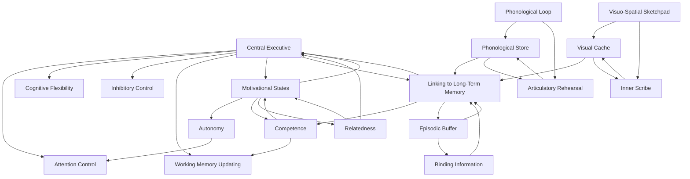

**USER**

let's parameterize the three motivational states (autonomy, competence, relatedness) as independent components that evaluate/score the agents current orientation towards that state. the end goal here will be to modularize this in a way such that we can model cognition via agent based modeling, where agents will represent interacting sub components, and any given subcomponent will likely be described as the mean field over the "particle cloud" of agents representing it. so for example, we might have a different particle for each belief or independent decision policy the agent might hold, and the particles will attract and repel each others respective influence with respect to the motivational and attentional vector fields to influence the ultimate behavior of the agent

**ASSISTANT**

To model the cognitive agent with a more modular approach, representing subcomponents as agent-based models (ABMs), we'll parameterize the three motivational states (autonomy, competence, relatedness) as independent components. Each component will evaluate and score the agent's current orientation towards that state. We will also represent each cognitive subcomponent and motivational state as a mean field over a "particle cloud" of agents.

Below is the updated Mermaid markdown directed graph diagram, incorporating these ideas.

### Modularized Components as Particle Clouds

1. **Central Executive (CE)**
   - **Attention Control (A)**: Particles representing different attention strategies.
   - **Cognitive Flexibility (F)**: Particles representing different flexibility strategies.
   - **Inhibitory Control (I)**: Particles representing different inhibitory control strategies.
   - **Working Memory Updating (W)**: Particles representing different updating strategies.

2. **Phonological Loop (PL)**
   - **Phonological Store (PS)**: Particles representing different verbal information units.
   - **Articulatory Rehearsal (AR)**: Particles representing different rehearsal strategies.

3. **Visuo-Spatial Sketchpad (VSSP)**
   - **Visual Cache (VC)**: Particles representing different visual data units.
   - **Inner Scribe (IS)**: Particles representing different spatial data units.

4. **Episodic Buffer (EB)**
   - **Binding Information (B)**: Particles representing different integrated information units.
   - **Linking to Long-Term Memory (LTM)**: Particles representing different memory link strategies.

5. **Motivational States (MS)**
   - **Autonomy (AU)**: Particles representing different autonomy-related behaviors and evaluations.
   - **Competence (CO)**: Particles representing different competence-related behaviors and evaluations.
   - **Relatedness (RE)**: Particles representing different relatedness-related behaviors and evaluations.

### Dynamic Interactions

- **Particle Interaction Mechanism**: 
  - **Attraction**: Particles attract each other based on positive reinforcement or alignment with motivational states.
  - **Repulsion**: Particles repel each other based on conflicts or negative reinforcement.
  - **Mean Field**: Each component's behavior is the result of the average influence of its particles.

- **Feedback Mechanisms**: 
  - **Bidirectional Influences**: Each component influences and is influenced by other components, creating a dynamic system.
  - **Motivational States**: These states continuously evaluate and modify the behavior of other cognitive components.

### Summary

This model allows for a highly modular and dynamic representation of cognition, suitable for agent-based modeling. Each cognitive and motivational component is represented as a collection of interacting agents (particles), enabling the simulation of complex behaviors and their emergent properties. The interactions between components ensure that the system is adaptive and responsive to changing internal and external conditions.

---

preceding: [[sorry i shouldn't have said acyclic. this will be a directed graph yes, but i think it will definitely have cycles. let's try again]]

See also: [[emergent properties]]

See also: [[relatedness]]

See also: [[long-term memory]]

See also: [[vector field]]

See also: [[working memory]]