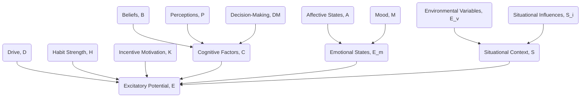

**USER**

mermaid diagram of the hierarchical model

**ASSISTANT**

Sure! Here is a mermaid diagram representing the hierarchical model of behavior parameterization:

This mermaid diagram visualizes the hierarchical structure of the [[behavioral equation]], showing how different factors influence the excitatory potential. Each component's influence on \( E \) is clearly depicted, as well as the sub-components contributing to cognitive factors, emotional states, and situational context.

---

preceding: [[diagram of behavior parameterization as a graphical model]]  

following: [[cognitive immune response model]]