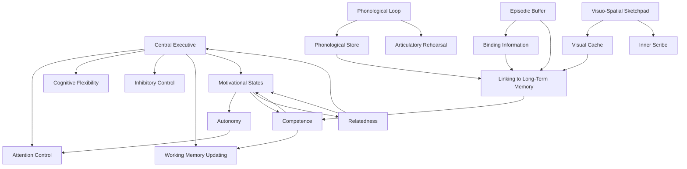

**USER**

parameterize a draft model in graphical form as a mermaid markdown directed graph diagram

**ASSISTANT**

Below is a draft model of the cognitive agent based on Baddeley's model of working memory and self-determination theory, represented as a Mermaid markdown directed graph diagram.

In this diagram:
- The **Central Executive** coordinates various cognitive processes: attention control, cognitive flexibility, inhibitory control, and working memory updating.
- The **Phonological Loop** handles verbal and auditory information through the phonological store and articulatory rehearsal process.
- The **Visuo-Spatial Sketchpad** manages visual and spatial information via the visual cache and inner scribe.
- The **Episodic Buffer** integrates information across domains and links working memory to long-term memory.
- **Motivational States** are governed by the components of self-determination theory: autonomy, competence, and relatedness.
- Interactions show how cognitive components are influenced by and influence motivational states.
- Feedback loops demonstrate how information in long-term memory affects competence and, subsequently, motivational states.

---

preceding: [[enumerate all of the components of cognition i would need to model to simulate a cognitive agent based on baddeley's model of working memory and self-determination theory]]  

following: [[sorry i shouldn't have said acyclic. this will be a directed graph yes, but i think it will definitely have cycles. let's try again]]

See also: [[baddeley's model of working memory]]

See also: [[self-determination theory]]

See also: [[long-term memory]]

See also: [[visual cache]]

See also: [[working memory]]