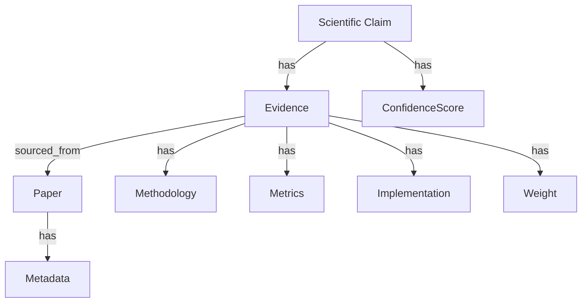

**USER**

structure the ontology as a knowledge graph


**ASSISTANT**

# Research Knowledge Graph Schema

## Core Types



## Graph Model
$G = (V, E, W, L)$ where:

```
V = {
  claims: Set<Claim>,
  evidence: Set<Evidence>,
  papers: Set<Paper>,
  implementations: Set<Implementation>
}

E = {
  corroborates: (Evidence, Claim),
  contradicts: (Evidence, Claim),
  depends_on: (Claim, Claim),
  implements: (Implementation, Claim)
}

W = {
  evidence_weight: Evidence → [0,1],
  confidence: Claim → [0,1]
}

L = {
  paper_metadata: Paper → Metadata,
  metric_values: Evidence → Metrics,
  methodology: Evidence → Method
}
```

## Example Instance
```
Nodes: {
  claim_c1: "Dropout reduces overfitting",
  evidence_e1: {
    paper: "Hinton2012",
    metrics: {accuracy: "+2%"},
    weight: 0.8
  },
  evidence_e2: {
    paper: "Wager2013",
    type: "theoretical",
    weight: 0.9
  }
}

Edges: {
  (e1, c1): {type: "corroborates"},
  (e2, c1): {type: "corroborates"},
  (c1, "regularization"): {type: "depends_on"}
}
```

## Query Interface
```sql
MATCH (c:Claim)-[:has]->(e:Evidence)
WHERE c.confidence > 0.8
  AND e.reproduction_count >= 2
RETURN c, COLLECT(e) as evidence
```


---

preceding: [[multi-source corroboration ontology]]  


following: [[research knowledge graph with benchmark verification]]

See also: [[enhanced research knowledge graph schema]]