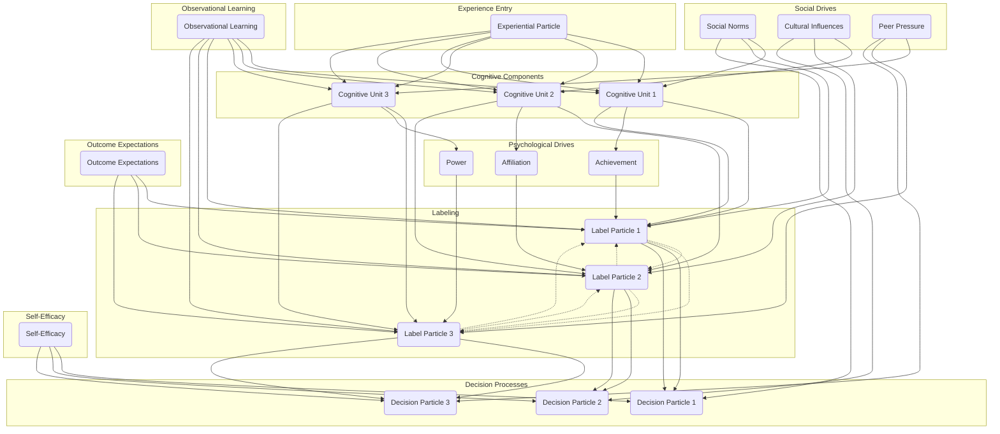

**USER**

Social Cognitive Theory

**ASSISTANT**

### Social Cognitive Theory

Social Cognitive Theory (SCT), developed by [[Albert Bandura]], posits that learning occurs in a social context and is facilitated through observation, imitation, and modeling. It emphasizes the interplay between cognitive, behavioral, and environmental influences, which shape individual behavior and learning processes.

### Key Components of Social Cognitive Theory

1. **Observational Learning (Modeling)**:
   - **Definition**: Learning by observing the actions and outcomes of others' behaviors.
   - **Processes**:
     - **Attention**: Noticing the behavior.
     - **Retention**: Remembering the behavior.
     - **Reproduction**: Ability to perform the behavior.
     - **Motivation**: Willingness to perform the behavior.

2. **Self-Efficacy**:
   - **Definition**: Belief in one's capability to execute behaviors necessary to produce specific performance attainments.
   - **Sources**:
     - **Mastery Experiences**: Successful experiences boost self-efficacy.
     - **Vicarious Experiences**: Observing others' success can strengthen self-efficacy.
     - **Verbal Persuasion**: Encouragement from others can enhance self-efficacy.
     - **Physiological and Emotional States**: Positive emotional states can improve self-efficacy.

3. **Reciprocal Determinism**:
   - **Definition**: A model that explains how individuals, their behaviors, and the environment interact and influence each other.
   - **Components**:
     - **Personal Factors**: Cognitive, affective, and biological events.
     - **Behavior**: Actions performed by the individual.
     - **Environmental Factors**: External social context and physical environment.

4. **Outcome Expectations**:
   - **Definition**: Beliefs about the likely outcomes of behaviors.
   - **Types**:
     - **Physical Outcomes**: Tangible rewards or consequences.
     - **Social Outcomes**: Social responses, such as approval or disapproval.
     - **Self-Evaluative Outcomes**: Personal satisfaction or self-criticism.

### Integrating SCT with the Cognitive Immune Response Model

To integrate SCT into the [[cognitive immune response model]], we can incorporate the concepts of observational learning, self-efficacy, and reciprocal determinism. This will enrich the model by including social and cognitive influences on behavior.

#### Modified Model Components

1. **Experiential Particle (E_x)**: Represents an incoming experience or data.
2. **Cognitive Unit (C_x)**: Represents cognitive components that process the experience based on relevance and salience.
3. **Labeling Particles (L_i)**: Represent judgments or labels assigned to experiences, such as causal orientation or drive satisfaction.
4. **Decision Particles (D_j)**: Represent particles involved in decision-making processes, recruited based on the dominating labels.
5. **Psychological Drives (P_D)**: Influence the attraction and labeling processes.
6. **Social Drives (S_D)**: Influence the attraction, labeling, and decision-making processes.
7. **Observational Learning (O_L)**: Influences cognitive units and labeling particles through modeling and imitation.
8. **Self-Efficacy (S_E)**: Influences decision particles based on the belief in one's ability to perform the behavior.
9. **Outcome Expectations (O_E)**: Affect the attractiveness of labels and decisions based on anticipated outcomes.

### Enhanced Graphical Model

Here is an updated mermaid diagram representing the integration of Social Cognitive Theory:

### Explanation and Empirical Alignment

- **Experiential Particle (E_x)**: Represents incoming sensory input or external stimuli.
- **Cognitive Units (C_x)**: Neural or cognitive modules activated by relevance, salience, and [[psychological drives]].
- **Labeling Particles (L_i)**: Judgments formed through cognitive appraisal processes, influenced by psychological and social drives.
- **Decision Particles (D_j)**: Decision-making nodes influenced by the dominant labels, social drives, and self-efficacy.
- **Psychological Drives (P_D)**: Represent innate and learned motivations influencing cognitive and labeling processes.
- **Social Drives (S_D)**: Represent social influences affecting cognitive, labeling, and decision-making processes.
- **Observational Learning (O_L)**: Learning through observing others, influencing cognitive units and labeling particles.
- **Self-Efficacy (S_E)**: Belief in one's ability to execute behaviors, influencing decision-making processes.
- **Outcome Expectations (O_E)**: Beliefs about the outcomes of behaviors, affecting the attractiveness of labels and decisions.

### Empirical Foundations and Applications

1. **Observational Learning**: Bandura's studies on modeling show how individuals learn behaviors by observing others (e.g., [[Bobo Doll Experiment]]).
2. **Self-Efficacy**: Research demonstrates that higher self-efficacy leads to greater persistence and success in tasks (e.g., [[Self-Efficacy Theory]]).
3. **Outcome Expectations**: Studies indicate that expectations of positive outcomes motivate behavior (e.g., [[Expectancy Theory]]).

### Conclusion

By integrating Social Cognitive Theory into the [[cognitive immune response model]], we create a robust framework that accounts for the dynamic interplay between cognitive, emotional, psychological, and social factors. This enhanced model aligns with empirical research and provides a comprehensive basis for understanding how experiences are processed, judged, and acted upon in a social context. For further exploration, consider reviewing related topics such as [[Self-Efficacy Theory]], [[Expectancy Theory]], and [[Bobo Doll Experiment]] within this vault.

---

preceding: [[integration of psychological and social drives in the [[cognitive immune response model]]]]  

following: [[expectancy theory]]---
date: 1718523934.52514
tags:
- autogenerated
- source__oai
- conversation_id__addb9b20-fdd6-4d68-8279-334673d7440c
- msg_aaa22e61-2ecd-48e6-8e26-1f13641de245
- msg_8d6aa6ac-8481-4185-871c-027a59310625
title: social cognitive theory
---

**USER**

Social Cognitive Theory

**ASSISTANT**

### Social Cognitive Theory

**Social Cognitive Theory (SCT)**, developed by [[Albert Bandura]], provides a framework for understanding how individuals learn and maintain behaviors through the interplay of personal, behavioral, and environmental influences. It emphasizes the role of observational learning, social experiences, and reciprocal determinism in shaping behavior.

#### Theoretical Foundations

1. **Reciprocal Determinism**: Central to SCT is the concept of reciprocal determinism, which posits that behavior, personal factors (including cognitive, affective, and biological events), and environmental influences all interact and influence each other.

   $$ \text{Behavior} \leftrightarrow \text{Personal Factors} \leftrightarrow \text{Environmental Influences} $$

2. **Observational Learning (Modeling)**: SCT highlights that people can learn new behaviors by observing others. This process, known as modeling, involves attention, retention, reproduction, and motivation.

   - **Attention**: Observers must pay attention to the behavior being modeled.
   - **Retention**: Observers must remember the behavior.
   - **Reproduction**: Observers must have the ability to replicate the behavior.
   - **Motivation**: Observers must have a reason to adopt the behavior.

3. **Self-Efficacy**: A critical component of SCT is the concept of self-efficacy, which refers to an individual's belief in their ability to execute behaviors necessary to produce specific outcomes. Self-efficacy influences task selection, effort, persistence, and resilience.

   $$ \text{Self-Efficacy} \approx \text{Belief in Ability to Succeed} $$

#### Psychological Mechanisms

1. **Cognitive Processes**: SCT emphasizes the role of cognitive processes in learning and behavior. These include goal setting, self-regulation, and the use of self-reflective and analytical thinking to evaluate personal performance and progress.

2. **Vicarious Reinforcement**: Learning is not solely based on direct experiences but also on observing the consequences of others' behaviors. Vicarious reinforcement involves learning from the rewards and punishments that others receive.

3. **Outcome Expectations**: SCT posits that individuals' expectations about the outcomes of their behaviors influence their actions. Positive outcome expectations increase the likelihood of a behavior being performed.

4. **Self-Regulation**: SCT involves self-regulation, where individuals monitor their own behavior, set personal goals, and evaluate their progress. Self-regulation is influenced by self-efficacy and the ability to manage one's actions in the pursuit of goals.

#### Implications for Behavior and Performance

1. **Education**: SCT has profound implications for education. Teachers can use modeling, provide positive reinforcement, and enhance students' self-efficacy to improve learning outcomes. Collaborative learning environments that encourage peer modeling and feedback can be particularly effective.

2. **Health Behavior**: SCT is widely applied in health behavior change. Interventions that increase self-efficacy, provide models of healthy behavior, and create supportive environments can effectively promote behaviors such as exercise, healthy eating, and smoking cessation.

3. **Workplace Performance**: In organizational settings, SCT can be used to design training programs that incorporate modeling, feedback, and goal-setting to enhance employee performance and motivation. Leaders can serve as role models, and positive reinforcement can cultivate a productive work environment.

4. **Social Change**: SCT can inform strategies for social change by leveraging media and influential figures to model positive behaviors. Public health campaigns and social movements often use SCT principles to influence attitudes and behaviors on a large scale.

#### Measurement and Assessment

1. **Self-Efficacy Scales**: Various scales measure self-efficacy in specific domains, such as academic self-efficacy, health self-efficacy, and job self-efficacy. These scales assess individuals' confidence in their ability to perform specific tasks.

2. **Observational Learning Assessment**: Tools such as the Observational Learning Scale (OLS) measure the extent to which individuals learn from observing others. This includes assessing the components of attention, retention, reproduction, and motivation.

3. **Behavioral Observations**: Direct observation of behavior in naturalistic or controlled settings can provide insights into the application of SCT principles. This includes assessing the impact of modeling, reinforcement, and self-regulation on behavior.

#### Interventions

1. **Modeling and Social Learning**: Designing interventions that include positive role models can enhance learning and behavior change. This is particularly effective in educational, organizational, and health contexts.

2. **Self-Efficacy Enhancement**: Interventions aimed at increasing self-efficacy can involve mastery experiences, vicarious learning, social persuasion, and improving emotional and physiological states. Techniques such as goal setting and providing constructive feedback are crucial.

3. **Behavioral Self-Regulation**: Teaching self-regulation skills can help individuals set and achieve personal goals. This includes self-monitoring, goal-setting, and self-reward strategies.

4. **Environmental Structuring**: Modifying environmental factors to support desired behaviors can enhance the effectiveness of SCT-based interventions. This involves creating supportive social and physical environments that facilitate positive behavior change.

#### Conclusion

Social Cognitive Theory offers a comprehensive framework for understanding and influencing behavior through the interplay of personal, behavioral, and environmental factors. By leveraging principles such as modeling, self-efficacy, and self-regulation, interventions can effectively promote learning and behavior change across various domains. Exploring related concepts such as [[self-efficacy]], [[observational learning]], and [[behavioral self-regulation]] can further enhance our understanding and application of SCT in promoting positive outcomes.

---

preceding: [[self-efficacy theory]]  

following: [[reciprocal determinism]]

See also: [[decision-making processes]]

See also: [[social influence]]

See also: [[analytical thinking]]

See also: [[behavior change]]