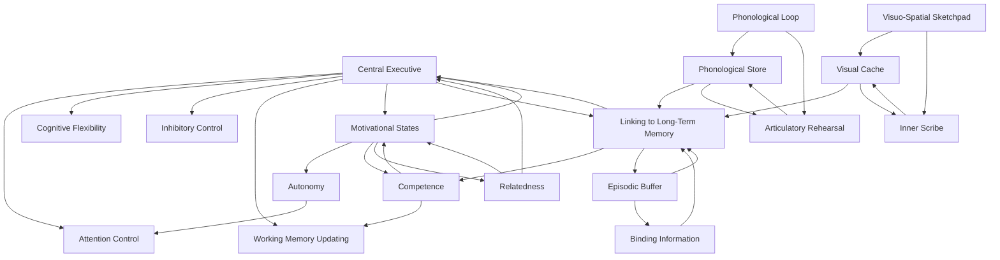

**USER**

sorry i shouldn't have said acyclic. this will be a directed graph yes, but i think it will definitely have cycles. let's try again

**ASSISTANT**

No problem! Below is a revised version of the draft model as a Mermaid markdown directed graph diagram, accounting for potential cycles.

In this diagram:
- The **Central Executive** coordinates various cognitive processes: attention control, cognitive flexibility, inhibitory control, and working memory updating.
- The **Phonological Loop** handles verbal and auditory information through the phonological store and articulatory rehearsal process.
- The **Visuo-Spatial Sketchpad** manages visual and spatial information via the visual cache and inner scribe.
- The **Episodic Buffer** integrates information across domains and links working memory to long-term memory.
- **Motivational States** are governed by the components of self-determination theory: autonomy, competence, and relatedness.
- Interactions show how cognitive components are influenced by and influence motivational states.
- Feedback loops demonstrate how information in long-term memory affects competence and subsequently motivational states, which in turn influence the central executive.
- Cycles represent dynamic and continuous interactions within and between components.

---

preceding: [[parameterize a draft model in graphical form as a mermaid markdown directed graph diagram]]  

following: [[let's parameterize the three motivational states (autonomy, competence, relatedness) as independent components that evaluatescore the agents current orientation towards that state. the end goal here w]]

See also: [[self-determination theory]]

See also: [[long-term memory]]

See also: [[central executive]]

See also: [[visual cache]]

See also: [[working memory]]