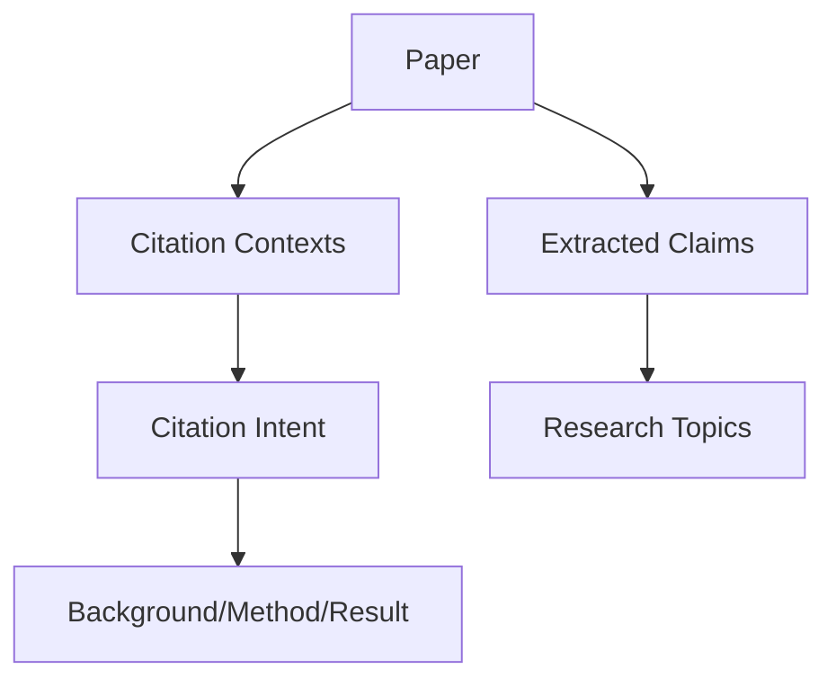

**USER**

tell me more about the claim tracking in semantic scholar

**ASSISTANT**

Semantic Scholar's claim tracking focuses on extracting citations and influence rather than atomic knowledge units. Their system:

Key limitations:
1. Claims extracted at paper-level granularity
2. No explicit tracking of deprecated/superseded claims  
3. Citation intents too coarse for tracking theoretical developments
4. No benchmark reliability propagation
5. No distinction between theoretical/empirical contributions

They use ML models to extract:
- Citation contexts and intent classification
- High-level research claims
- Topic categorization
- Influence through citation networks

Their approach prioritizes broad coverage over granular knowledge tracking, making it less suitable for tracking detailed ML training recommendations or theoretical developments.

Papers using their dataset: arXiv:2002.05442, arXiv:1909.04758

---

preceding: [[are there any publicly available knowledge stores which factorize information in a manner similar to that which we've discussed]]  

following: [[citation intent taxonomy]]